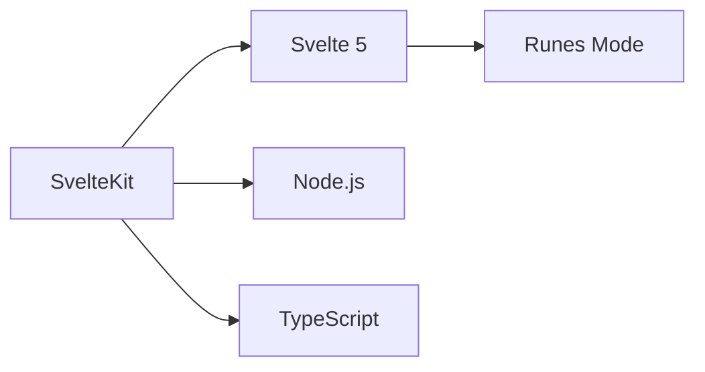
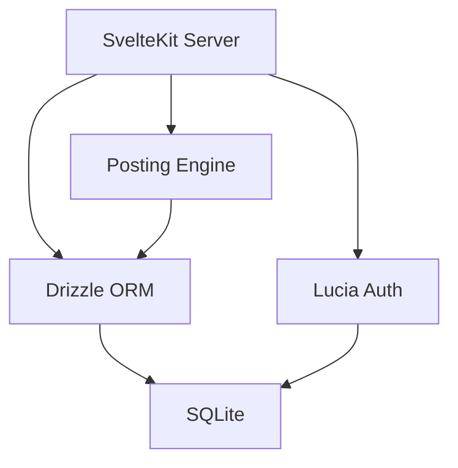
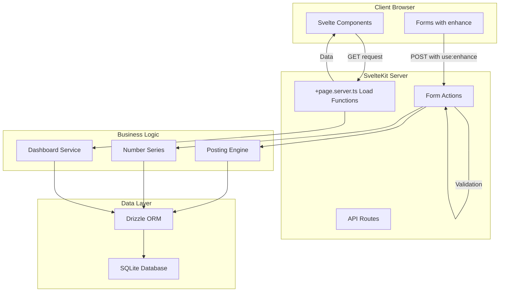
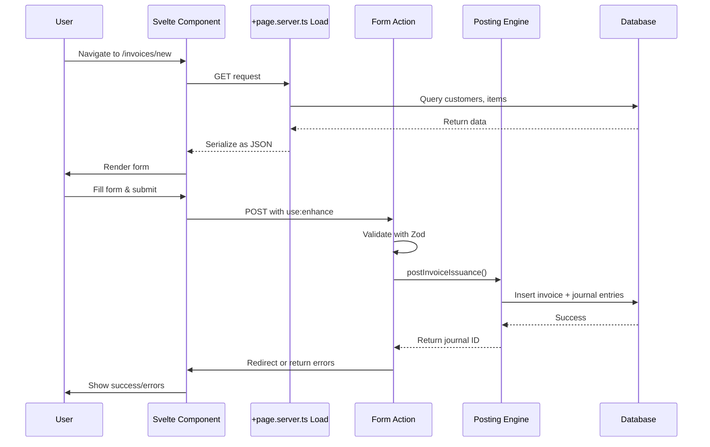
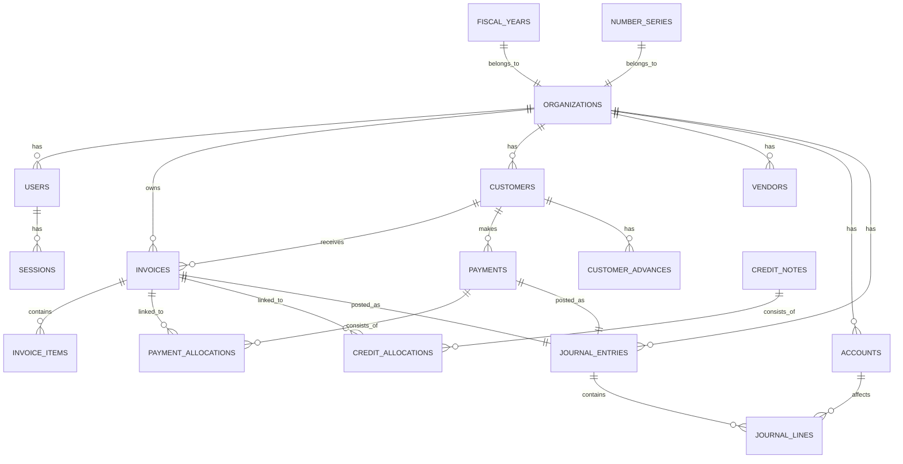
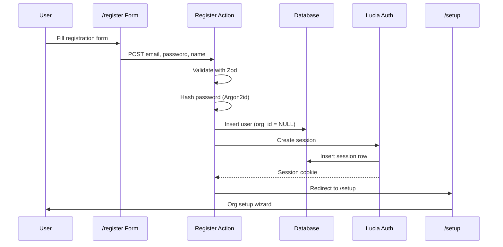
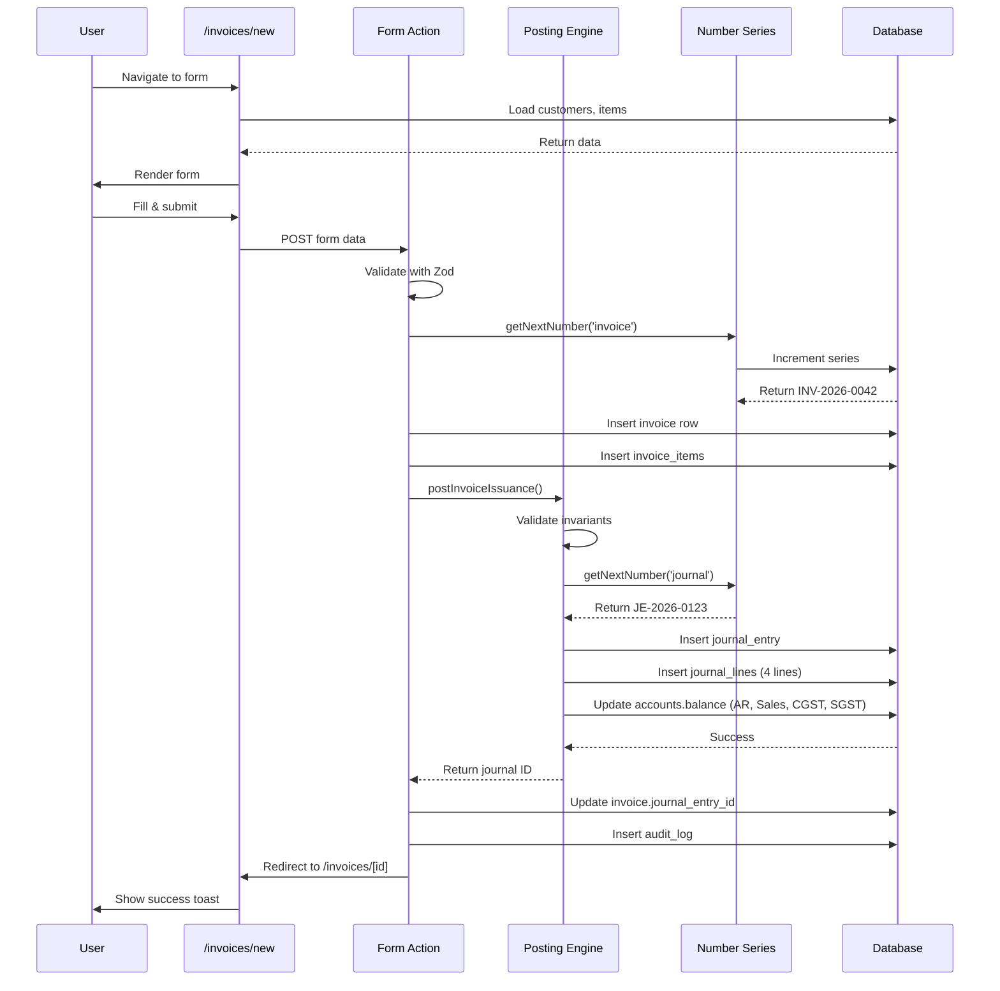
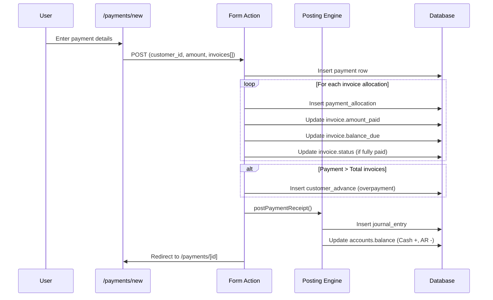
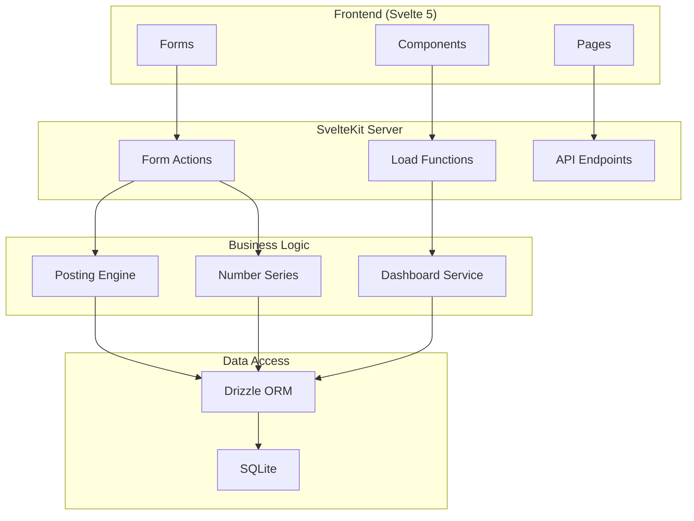
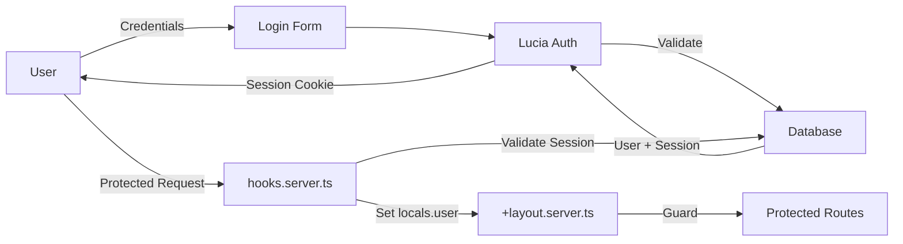

# OpenBill - System Architecture Documentation

> **Comprehensive technical documentation for developers and LLMs**  
> Version: Pre-Alpha 2.0  
> Last Updated: February 2026

---

## Table of Contents

1. [Executive Summary](#executive-summary)
2. [Technology Stack](#technology-stack)
3. [System Architecture](#system-architecture)
4. [Database Schema](#database-schema)
5. [Authentication & Authorization](#authentication--authorization)
6. [Business Logic Layer](#business-logic-layer)
7. [Frontend Architecture](#frontend-architecture)
8. [API & Routing Structure](#api--routing-structure)
9. [Data Flow Examples](#data-flow-examples)
10. [Critical Gotchas & Design Decisions](#critical-gotchas--design-decisions)
11. [Deployment](#deployment)

---

## Executive Summary

**OpenBill** is a self-hosted, double-entry accounting system designed specifically for **Indian micro enterprises**. It provides GST-compliant invoicing, payment allocation, expense tracking, and financial reporting—all while maintaining strict accounting integrity through database-level constraints and a robust posting engine.

### Key Features

- ✅ **GST-Compliant Invoicing** (CGST/SGST/IGST with intra/inter-state routing)
- ✅ **Customer & Vendor Management**
- ✅ **Payment Allocation** with overpayment handling (advance credits)
- ✅ **Expense Tracking** with input GST split
- ✅ **Credit Notes** for returns/adjustments
- ✅ **Double-Entry Posting Engine** with accounting invariants
- ✅ **Financial Reports** (Aging, Ledger, GST Summary, P&L)
- ✅ **PDF Generation** for invoices and statements
- ✅ **Audit Logging** for all financial transactions

---

## Technology Stack

### Core Framework



| Layer | Technology | Version | Purpose |
|:------|:-----------|:--------|:--------|
| **Meta-Framework** | SvelteKit | 2.50+ | Full-stack SSR, routing, form actions |
| **UI Library** | Svelte | 5.48+ | Reactive UI components (Runes mode) |
| **Language** | TypeScript | 5.9+ | Type safety across frontend/backend |
| **Runtime** | Node.js | 18+ | Server-side execution |

### Frontend

```typescript
// Frontend Stack
{
  "Styling": "Tailwind CSS v4",
  "Components": "shadcn-svelte (bits-ui)",
  "Icons": "Lucide Svelte",
  "Forms": "sveltekit-superforms",
  "Notifications": "svelte-sonner"
}
```

### Backend & Database



| Component | Technology | Purpose |
|:----------|:-----------|:--------|
| **Database** | SQLite (better-sqlite3) | Embedded SQL database |
| **ORM** | Drizzle ORM | Type-safe database queries |
| **Auth** | Lucia v3 | Session-based authentication |
| **Validation** | Zod | Schema validation |
| **Math** | Decimal.js | Precision financial calculations |
| **PDF** | pdfmake | Invoice/statement generation |

### Key Design Decisions

#### Why SQLite?

- ✅ **Zero configuration** - Perfect for self-hosted deployments
- ✅ **Fast reads** - Entire database in single file, no network overhead
- ✅ **ACID compliant** - Essential for financial data integrity
- ✅ **Portable** - Easy backups (just copy the .db file)
- ⚠️ **Single-writer** - Suitable for micro enterprises (1-10 concurrent users)

#### Why Drizzle ORM?

- ✅ Type-safe queries with full IntelliSense
- ✅ Lightweight (no runtime overhead like Prisma)
- ✅ SQL-first approach (easy debugging)
- ✅ Excellent migration system

#### Why Lucia Auth?

- ✅ Lightweight session-based auth (no JWT complexity)
- ✅ Full control over database schema
- ✅ Built for SvelteKit (native form action support)
- ✅ Security-first defaults

#### Why Decimal.js?

```typescript
// CRITICAL: Never use JavaScript number for money
const wrong = 0.1 + 0.2; // 0.30000000000000004
const correct = addCurrency(0.1, 0.2); // 0.30
```

JavaScript's `Number` type uses IEEE 754 floating-point, which causes rounding errors. Financial calculations **must** use `Decimal.js`.

---

## System Architecture



### Request Flow



### Directory Structure

```
src/
├── lib/
│   ├── components/         # Reusable UI components
│   │   ├── ui/            # shadcn-svelte base components
│   │   ├── forms/         # Form-specific components
│   │   └── layout/        # Layout components (Header, Sidebar)
│   ├── server/            # Server-only code
│   │   ├── db/
│   │   │   ├── index.ts   # Database connection
│   │   │   └── schema/    # Drizzle schemas (17 tables)
│   │   ├── services/
│   │   │   ├── posting-engine.ts  # Double-entry posting logic
│   │   │   ├── number-series.ts   # Auto-increment generators
│   │   │   └── dashboard.ts       # Dashboard aggregations
│   │   ├── accounting/
│   │   │   └── invariants.ts      # Accounting rule validation
│   │   ├── auth.ts        # Lucia configuration
│   │   ├── email.ts       # Nodemailer setup
│   │   └── seed.ts        # Chart of accounts seeding
│   └── utils/             # Shared utilities
│       ├── currency.ts    # Decimal.js wrappers
│       └── gst.ts         # GST calculation helpers
├── routes/
│   ├── (app)/             # Authenticated routes (requires login)
│   │   ├── dashboard/
│   │   ├── invoices/
│   │   ├── payments/
│   │   ├── expenses/
│   │   ├── customers/
│   │   ├── vendors/
│   │   ├── items/
│   │   ├── credit-notes/
│   │   ├── reports/
│   │   ├── journals/
│   │   ├── accounts/
│   │   ├── settings/
│   │   └── activity-log/
│   ├── register/          # Public signup
│   ├── login/             # Public login
│   ├── setup/             # Post-registration org setup
│   ├── api/               # JSON API endpoints
│   └── +layout.server.ts  # Root authentication check
├── hooks.server.ts        # Global request hooks (auth middleware)
└── app.css                # Global styles (Tailwind directives)
```

---

## Database Schema

### Entity Relationship Diagram



### Core Tables (17 Total)

#### 1. Organizations & Users

```sql
-- organizations: Tenant entity (multi-tenant ready)
CREATE TABLE organizations (
    id TEXT PRIMARY KEY,
    name TEXT NOT NULL,
    gstin TEXT,               -- 15-char GST number or NULL
    state_code TEXT NOT NULL, -- 2-digit state code (e.g., '29' for Karnataka)
    address TEXT,
    pincode TEXT,
    bank_details JSON,
    ...
);

-- users: Application users (linked to org)
CREATE TABLE users (
    id TEXT PRIMARY KEY,
    org_id TEXT REFERENCES organizations(id),
    email TEXT UNIQUE NOT NULL,
    password_hash TEXT NOT NULL,
    role TEXT DEFAULT 'admin' -- admin, user
);
```

#### 2. Chart of Accounts (COA)

```sql
-- accounts: Double-entry account structure
CREATE TABLE accounts (
    id TEXT PRIMARY KEY,
    org_id TEXT NOT NULL,
    account_code TEXT NOT NULL,     -- e.g., '1200', '4000'
    account_name TEXT NOT NULL,     -- e.g., 'Accounts Receivable', 'Sales Revenue'
    account_type TEXT NOT NULL,     -- asset, liability, equity, income, expense
    parent_id TEXT,                 -- Hierarchical structure
    balance REAL DEFAULT 0,         -- Running balance
    is_system BOOLEAN DEFAULT FALSE -- Cannot be deleted if TRUE
    UNIQUE(org_id, account_code)
);
```

**Standard Chart of Accounts:**

| Code | Account Name | Type | Purpose |
|:-----|:-------------|:-----|:--------|
| **1000** | Cash in Hand | Asset | Cash payments |
| **1100** | Bank Account | Asset | Bank/UPI transactions |
| **1200** | Accounts Receivable | Asset | Customer outstanding |
| **1300** | Input CGST | Asset | GST paid on purchases |
| **1301** | Input SGST | Asset | GST paid on purchases |
| **1302** | Input IGST | Asset | GST paid on purchases |
| **2000** | Accounts Payable | Liability | Vendor outstanding |
| **2100** | Output CGST | Liability | GST collected on sales |
| **2101** | Output SGST | Liability | GST collected on sales |
| **2102** | Output IGST | Liability | GST collected on sales |
| **3000** | Owner's Equity | Equity | Initial capital |
| **4000** | Sales Revenue | Income | Product/service sales |
| **5000** | Operating Expenses | Expense | General expenses |

#### 3. Customers & Vendors

```sql
-- customers: AR parties
CREATE TABLE customers (
    id TEXT PRIMARY KEY,
    org_id TEXT NOT NULL,
    name TEXT NOT NULL,
    gstin TEXT,                     -- Customer GSTIN (optional)
    state_code TEXT,                -- For GST calculation
    email TEXT,
    phone TEXT,
    address TEXT,
    credit_limit REAL DEFAULT 0,
    balance REAL DEFAULT 0          -- Running AR balance
);

-- vendors: AP parties (for future expense management)
CREATE TABLE vendors (
    id TEXT PRIMARY KEY,
    org_id TEXT NOT NULL,
    name TEXT NOT NULL,
    gstin TEXT,
    pan TEXT,
    balance REAL DEFAULT 0          -- Running AP balance
);
```

#### 4. Invoices

```sql
-- invoices: Sales invoices
CREATE TABLE invoices (
    id TEXT PRIMARY KEY,
    org_id TEXT NOT NULL,
    customer_id TEXT NOT NULL,
    invoice_number TEXT NOT NULL,   -- INV-2026-0001
    invoice_date TEXT NOT NULL,
    due_date TEXT NOT NULL,
    status TEXT DEFAULT 'draft',    -- draft, issued, partially_paid, paid, cancelled
    
    -- Amounts (all REAL for SQLite compatibility)
    subtotal REAL DEFAULT 0,
    discount_amount REAL DEFAULT 0,
    taxable_amount REAL DEFAULT 0,
    cgst REAL DEFAULT 0,
    sgst REAL DEFAULT 0,
    igst REAL DEFAULT 0,
    total REAL DEFAULT 0,
    amount_paid REAL DEFAULT 0,
    balance_due REAL DEFAULT 0,
    
    -- GST flags
    is_inter_state BOOLEAN DEFAULT FALSE,
    
    -- Journal reference
    journal_entry_id TEXT REFERENCES journal_entries(id),
    
    -- Idempotency (prevents duplicate submissions)
    idempotency_key TEXT,
    
    UNIQUE(org_id, invoice_number)
);

-- invoice_items: Line items
CREATE TABLE invoice_items (
    id TEXT PRIMARY KEY,
    invoice_id TEXT NOT NULL REFERENCES invoices(id) ON DELETE CASCADE,
    description TEXT NOT NULL,
    hsn_code TEXT,
    quantity REAL DEFAULT 1,
    unit TEXT DEFAULT 'nos',
    rate REAL NOT NULL,
    gst_rate REAL DEFAULT 18,       -- 0, 5, 12, 18, 28
    cgst REAL DEFAULT 0,
    sgst REAL DEFAULT 0,
    igst REAL DEFAULT 0,
    amount REAL NOT NULL,
    total REAL NOT NULL
);
```

#### 5. Payments & Allocations

```sql
-- payments: Customer payments
CREATE TABLE payments (
    id TEXT PRIMARY KEY,
    org_id TEXT NOT NULL,
    customer_id TEXT NOT NULL,
    payment_number TEXT NOT NULL,   -- PAY-2026-0001
    payment_date TEXT NOT NULL,
    amount REAL NOT NULL,
    payment_mode TEXT NOT NULL,     -- cash, bank, upi, cheque
    deposit_to TEXT NOT NULL,       -- Account ID (1000 or 1100)
    journal_entry_id TEXT REFERENCES journal_entries(id),
    UNIQUE(org_id, payment_number)
);

-- payment_allocations: Links payments to invoices
CREATE TABLE payment_allocations (
    id TEXT PRIMARY KEY,
    payment_id TEXT NOT NULL REFERENCES payments(id),
    invoice_id TEXT NOT NULL REFERENCES invoices(id),
    amount REAL NOT NULL
);

-- customer_advances: Overpayment tracking
CREATE TABLE customer_advances (
    id TEXT PRIMARY KEY,
    org_id TEXT NOT NULL,
    customer_id TEXT NOT NULL,
    payment_id TEXT REFERENCES payments(id),
    amount REAL NOT NULL,
    balance REAL NOT NULL           -- Remaining unapplied amount
);
```

#### 6. Journal Entries (Double-Entry Core)

```sql
-- journal_entries: Accounting journal header
CREATE TABLE journal_entries (
    id TEXT PRIMARY KEY,
    org_id TEXT NOT NULL,
    entry_number TEXT NOT NULL,     -- JE-2026-0001
    entry_date TEXT NOT NULL,
    reference_type TEXT NOT NULL,   -- INVOICE_ISSUED, PAYMENT_RECEIVED, etc.
    reference_id TEXT,              -- Source document ID
    narration TEXT,
    total_debit REAL NOT NULL,
    total_credit REAL NOT NULL,
    status TEXT DEFAULT 'posted',   -- draft, posted, reversed
    reversed_by TEXT,               -- Self-reference for reversal tracking
    UNIQUE(org_id, entry_number),
    
    -- ⚠️ ACCOUNTING INVARIANT: Debits MUST equal credits
    CHECK(ROUND(total_debit, 2) = ROUND(total_credit, 2))
);

-- journal_lines: Individual debit/credit entries
CREATE TABLE journal_lines (
    id TEXT PRIMARY KEY,
    journal_entry_id TEXT NOT NULL REFERENCES journal_entries(id),
    account_id TEXT NOT NULL REFERENCES accounts(id),
    debit REAL DEFAULT 0,
    credit REAL DEFAULT 0,
    party_type TEXT,                -- customer, vendor
    party_id TEXT,                  -- ID of customer/vendor
    narration TEXT,
    
    -- ⚠️ ACCOUNTING INVARIANTS
    CHECK(debit >= 0),              -- Non-negative debits
    CHECK(credit >= 0),             -- Non-negative credits
    CHECK(NOT (debit > 0 AND credit > 0)) -- Either debit OR credit, not both
);
```

#### 7. Credit Notes

```sql
-- credit_notes: Sales returns/adjustments
CREATE TABLE credit_notes (
    id TEXT PRIMARY KEY,
    org_id TEXT NOT NULL,
    customer_id TEXT NOT NULL,
    credit_note_number TEXT NOT NULL, -- CN-2026-0001
    credit_note_date TEXT NOT NULL,
    subtotal REAL DEFAULT 0,
    cgst REAL DEFAULT 0,
    sgst REAL DEFAULT 0,
    igst REAL DEFAULT 0,
    total REAL DEFAULT 0,
    journal_entry_id TEXT REFERENCES journal_entries(id),
    UNIQUE(org_id, credit_note_number)
);

-- credit_allocations: Links credit notes to invoices
CREATE TABLE credit_allocations (
    id TEXT PRIMARY KEY,
    credit_note_id TEXT NOT NULL REFERENCES credit_notes(id),
    invoice_id TEXT NOT NULL REFERENCES invoices(id),
    amount REAL NOT NULL
);
```

#### 8. Expenses

```sql
-- expenses: Purchase expenses with GST
CREATE TABLE expenses (
    id TEXT PRIMARY KEY,
    org_id TEXT NOT NULL,
    expense_date TEXT NOT NULL,
    vendor_id TEXT REFERENCES vendors(id),
    expense_account_id TEXT NOT NULL, -- Account ID (expense category)
    amount REAL NOT NULL,
    input_cgst REAL DEFAULT 0,
    input_sgst REAL DEFAULT 0,
    input_igst REAL DEFAULT 0,
    paid_through TEXT NOT NULL,     -- Account ID (1000 or 1100)
    description TEXT,
    journal_entry_id TEXT REFERENCES journal_entries(id)
);
```

#### 9. Supporting Tables

```sql
-- fiscal_years: Fiscal year definition
CREATE TABLE fiscal_years (
    id TEXT PRIMARY KEY,
    org_id TEXT NOT NULL,
    name TEXT NOT NULL,             -- FY 2025-26
    start_date TEXT NOT NULL,       -- 2025-04-01
    end_date TEXT NOT NULL,         -- 2026-03-31
    is_locked BOOLEAN DEFAULT FALSE
);

-- number_series: Auto-increment generators
CREATE TABLE number_series (
    id TEXT PRIMARY KEY,
    org_id TEXT NOT NULL,
    series_type TEXT NOT NULL,      -- invoice, payment, journal, etc.
    prefix TEXT,                    -- INV-, PAY-, JE-
    current_number INTEGER DEFAULT 0,
    UNIQUE(org_id, series_type)
);

-- audit_log: Immutable audit trail
CREATE TABLE audit_log (
    id TEXT PRIMARY KEY,
    org_id TEXT NOT NULL,
    user_id TEXT,
    action TEXT NOT NULL,           -- created, updated, deleted, posted
    entity_type TEXT NOT NULL,      -- invoice, payment, etc.
    entity_id TEXT,
    changes JSON,
    created_at TEXT DEFAULT CURRENT_TIMESTAMP
);

-- app_settings: Key-value configuration
CREATE TABLE app_settings (
    id TEXT PRIMARY KEY,
    org_id TEXT NOT NULL,
    setting_key TEXT NOT NULL,
    setting_value TEXT,
    UNIQUE(org_id, setting_key)
);

-- items: Product/service catalog
CREATE TABLE items (
    id TEXT PRIMARY KEY,
    org_id TEXT NOT NULL,
    name TEXT NOT NULL,
    description TEXT,
    hsn_code TEXT,
    unit TEXT DEFAULT 'nos',
    rate REAL,
    gst_rate REAL DEFAULT 18,
    is_active BOOLEAN DEFAULT TRUE
);
```

### Database Constraints & Invariants

The application enforces **Accounting Invariants** at multiple levels:

1. **Database Level** (SQLite CHECK constraints)
2. **ORM Level** (Drizzle schema validation)
3. **Application Level** (Posting Engine validation)

See **[Critical Gotchas](#critical-gotchas--design-decisions)** section for details.

---

## Authentication & Authorization

### Authentication Flow



### Lucia Auth Setup

```typescript
// src/lib/server/auth.ts
import { Lucia } from 'lucia';
import { DrizzleSQLiteAdapter } from '@lucia-auth/adapter-drizzle';

const adapter = new DrizzleSQLiteAdapter(db, sessions, users);

export const lucia = new Lucia(adapter, {
    sessionCookie: {
        attributes: {
            secure: !dev // HTTPS in production
        }
    },
    getUserAttributes: (attributes) => ({
        email: attributes.email,
        name: attributes.name,
        role: attributes.role,
        orgId: attributes.org_id
    })
});
```

### Session Management

```typescript
// src/hooks.server.ts
export const handle: Handle = async ({ event, resolve }) => {
    const sessionId = event.cookies.get(lucia.sessionCookieName);
    
    if (!sessionId) {
        event.locals.user = null;
        event.locals.session = null;
        return resolve(event);
    }
    
    const { session, user } = await lucia.validateSession(sessionId);
    
    if (session && session.fresh) {
        const sessionCookie = lucia.createSessionCookie(session.id);
        event.cookies.set(sessionCookie.name, sessionCookie.value, {
            path: '.',
            ...sessionCookie.attributes
        });
    }
    
    event.locals.session = session;
    event.locals.user = user;
    
    return resolve(event);
};
```

### Authorization Pattern

```typescript
// src/routes/(app)/+layout.server.ts
export const load: LayoutServerLoad = async (event) => {
    // Redirect to login if not authenticated
    if (!event.locals.user) {
        redirect(302, '/login');
    }
    
    // Redirect to setup if org not configured
    if (!event.locals.user.orgId) {
        redirect(302, '/setup');
    }
    
    return {
        user: event.locals.user
    };
};
```

### Password Hashing

```typescript
// Using Argon2id via @node-rs/argon2
import { hash, verify } from '@node-rs/argon2';

// Registration
const hashedPassword = await hash(password, {
    memoryCost: 19456,
    timeCost: 2,
    outputLen: 32,
    parallelism: 1
});

// Login
const validPassword = await verify(user.password_hash, password, {
    memoryCost: 19456,
    timeCost: 2,
    outputLen: 32,
    parallelism: 1
});
```

---

## Business Logic Layer

### Posting Engine (Double-Entry System)

The **Posting Engine** (`src/lib/server/services/posting-engine.ts`) is the **heart** of the accounting system. It ensures all financial transactions are recorded using double-entry bookkeeping.

#### Posting Rules

```typescript
// Invoice Issuance
// Debit: Accounts Receivable (1200) - Total
// Credit: Sales Revenue (4000) - Subtotal
// Credit: Output CGST/SGST/IGST (2100/2101/2102) - Tax

export async function postInvoiceIssuance(
    orgId: string,
    input: InvoicePostingInput
): Promise<PostingResult> {
    const lines: JournalLineInput[] = [
        { accountCode: '1200', debit: input.total, partyType: 'customer', partyId: input.customerId },
        { accountCode: '4000', credit: input.subtotal }
    ];
    
    if (input.cgst > 0) lines.push({ accountCode: '2100', credit: input.cgst });
    if (input.sgst > 0) lines.push({ accountCode: '2101', credit: input.sgst });
    if (input.igst > 0) lines.push({ accountCode: '2102', credit: input.igst });
    
    return post(orgId, {
        type: 'INVOICE_ISSUED',
        date: input.date,
        referenceId: input.invoiceId,
        narration: `Invoice issued: ${input.invoiceNumber}`,
        lines
    });
}
```

```typescript
// Payment Receipt
// Debit: Cash/Bank (1000/1100) - Amount
// Credit: Accounts Receivable (1200) - Amount

export async function postPaymentReceipt(
    orgId: string,
    input: PaymentPostingInput
): Promise<PostingResult> {
    const cashAccountCode = input.paymentMode === 'cash' ? '1000' : '1100';
    
    return post(orgId, {
        type: 'PAYMENT_RECEIVED',
        date: input.date,
        referenceId: input.paymentId,
        narration: `Payment received: ${input.paymentNumber}`,
        lines: [
            { accountCode: cashAccountCode, debit: input.amount },
            { accountCode: '1200', credit: input.amount, partyType: 'customer', partyId: input.customerId }
        ]
    });
}
```

#### Accounting Invariants

**Enforced at 3 levels:**

1. **Database Constraints**:
```sql
-- Total debits MUST equal total credits
CHECK(ROUND(total_debit, 2) = ROUND(total_credit, 2))

-- Each line is debit OR credit, not both
CHECK(NOT (debit > 0 AND credit > 0))

-- Amounts must be non-negative
CHECK(debit >= 0)
CHECK(credit >= 0)
```

2. **Application Validation** (`src/lib/server/accounting/invariants.ts`):
```typescript
export function validateNewEntry(lines: JournalLineData[]): void {
    // Rule 1: Minimum 2 lines
    if (lines.length < 2) {
        throw new AccountingInvariantError('MIN_LINES', 'Minimum 2 lines required');
    }
    
    // Rule 2: Total debits = total credits
    const totalDebit = addCurrency(...lines.map(l => l.debit));
    const totalCredit = addCurrency(...lines.map(l => l.credit));
    
    if (!currencyEquals(totalDebit, totalCredit)) {
        throw new AccountingInvariantError('BALANCED', 'Debits must equal credits');
    }
    
    // Rule 3: Each line is single-sided
    for (const line of lines) {
        if (line.debit > 0 && line.credit > 0) {
            throw new AccountingInvariantError('SINGLE_SIDED', 'Line cannot have both debit and credit');
        }
    }
}
```

3. **Immutability Rule**:
```typescript
// Posted entries CANNOT be edited - only reversed
export async function reverse(
    orgId: string,
    journalEntryId: string,
    reversalDate: string
): Promise<PostingResult> {
    // Fetch original entry
    const original = await db.select()
        .from(journal_entries)
        .where(eq(journal_entries.id, journalEntryId))
        .get();
    
    if (original.status === 'reversed') {
        throw new AccountingInvariantError('NOT_ALREADY_REVERSED', 'Already reversed');
    }
    
    // Create opposite entry (swap debits/credits)
    // ...
}
```

### Number Series Generator

```typescript
// src/lib/server/services/number-series.ts
export async function getNextNumber(
    orgId: string,
    seriesType: string
): Promise<string> {
    const series = await db.select()
        .from(number_series)
        .where(and(
            eq(number_series.org_id, orgId),
            eq(number_series.series_type, seriesType)
        ))
        .get();
    
    if (!series) {
        // Create default series
        await db.insert(number_series).values({
            id: crypto.randomUUID(),
            org_id: orgId,
            series_type: seriesType,
            prefix: getDefaultPrefix(seriesType),
            current_number: 0
        });
        return getNextNumber(orgId, seriesType); // Retry
    }
    
    const nextNumber = series.current_number + 1;
    const year = new Date().getFullYear();
    const formatted = `${series.prefix}-${year}-${String(nextNumber).padStart(4, '0')}`;
    
    // Update series
    await db.update(number_series)
        .set({ current_number: nextNumber })
        .where(eq(number_series.id, series.id));
    
    return formatted; // e.g., INV-2026-0001
}
```

### Dashboard Service

```typescript
// src/lib/server/services/dashboard.ts
export async function getDashboardMetrics(orgId: string) {
    // Sales this month
    const salesThisMonth = await db.select({
        total: sql<number>`SUM(${invoices.total})`
    })
    .from(invoices)
    .where(and(
        eq(invoices.org_id, orgId),
        eq(invoices.status, 'issued'),
        sql`strftime('%Y-%m', ${invoices.invoice_date}) = strftime('%Y-%m', 'now')`
    ));
    
    // Cash in hand (account balance)
    const cash = await db.select({ balance: accounts.balance })
        .from(accounts)
        .where(and(
            eq(accounts.org_id, orgId),
            eq(accounts.account_code, '1000')
        ))
        .get();
    
    // ... more metrics
    
    return {
        salesThisMonth: salesThisMonth[0]?.total || 0,
        cashInHand: cash?.balance || 0,
        // ...
    };
}
```

---

## Frontend Architecture

### Svelte 5 Runes Mode

OpenBill uses **Svelte 5 with Runes**, which is a **significant shift** from Svelte 4:

```svelte
<!-- OLD: Svelte 4 (deprecated) -->
<script>
    export let data;
    let count = 0;
    $: doubled = count * 2;
</script>

<!-- NEW: Svelte 5 Runes -->
<script>
    let { data } = $props();  // Props
    let count = $state(0);    // Reactive state
    let doubled = $derived(count * 2); // Derived state
</script>
```

### Component Structure

```typescript
// Example: Invoice Form Component
<script lang="ts">
    import { superForm } from 'sveltekit-superforms';
    import type { PageData } from './$types';
    
    let { data, form } = $props<{ data: PageData; form: any }>();
    
    // Initialize superform
    const {
        form: formData,
        errors,
        constraints,
        enhance,
        delayed
    } = superForm(data.form, {
        onUpdated: ({ form }) => {
            if (form.valid) {
                toast.success('Invoice created!');
            }
        }
    });
    
    // Reactive line items
    let lineItems = $state<LineItem[]>([...]);
    let subtotal = $derived(lineItems.reduce((sum, item) => sum + item.amount, 0));
</script>

<form method="POST" use:enhance>
    <!-- Form fields with error handling -->
    {#if $errors.customer_id}
        <span class="text-destructive">{$errors.customer_id}</span>
    {/if}
</form>
```

### Form Handling Pattern

```typescript
// +page.server.ts
import { superValidate } from 'sveltekit-superforms';
import { zod4 as zod } from 'sveltekit-superforms/adapters';

const schema = z.object({
    customer_id: z.string().min(1),
    invoice_date: z.string(),
    line_items: z.array(z.object({
        description: z.string(),
        quantity: z.number().positive(),
        rate: z.number().positive()
    })).min(1)
});

export const load = async ({ locals }) => {
    const form = await superValidate(zod(schema));
    const customers = await db.select().from(customers);
    
    return { form, customers };
};

export const actions = {
    default: async (event) => {
        const form = await superValidate(event, zod(schema));
        
        if (!form.valid) {
            return fail(400, { form });
        }
        
        // Business logic
        const invoiceId = await createInvoice(form.data);
        
        redirect(302, `/invoices/${invoiceId}`);
    }
};
```

### UI Component Library

OpenBill uses **shadcn-svelte** components based on **bits-ui**:

```typescript
// Example: Select component
import * as Select from '$lib/components/ui/select';

<Select.Root bind:value={selectedCustomer}>
    <Select.Trigger>
        {selectedCustomer?.name || 'Select customer'}
    </Select.Trigger>
    <Select.Content>
        {#each customers as customer}
            <Select.Item value={customer.id}>
                {customer.name}
            </Select.Item>
        {/each}
    </Select.Content>
</Select.Root>
```

---

## API & Routing Structure

### Route Groups

SvelteKit uses **folder-based routing** with **(group)** syntax for organization:

```
routes/
├── (app)/              # Protected routes (requires auth)
│   ├── +layout.server.ts   # Auth guard
│   ├── +layout.svelte      # App shell (sidebar, header)
│   └── dashboard/
│       ├── +page.server.ts # Load function
│       └── +page.svelte    # Component
├── login/              # Public
├── register/           # Public
├── api/                # JSON endpoints
│   ├── customers/
│   │   └── +server.ts  # GET /api/customers
│   └── invoices/
│       └── pdf/
│           └── +server.ts # GET /api/invoices/pdf?id=...
```

### API Endpoints

```typescript
// src/routes/api/invoices/pdf/+server.ts
import type { RequestHandler } from './$types';
import { generateInvoicePDF } from '$lib/server/pdf';

export const GET: RequestHandler = async ({ url, locals }) => {
    if (!locals.user) {
        return new Response('Unauthorized', { status: 401 });
    }
    
    const invoiceId = url.searchParams.get('id');
    const invoice = await db.select()
        .from(invoices)
        .where(eq(invoices.id, invoiceId))
        .get();
    
    const pdfBuffer = await generateInvoicePDF(invoice);
    
    return new Response(pdfBuffer, {
        headers: {
            'Content-Type': 'application/pdf',
            'Content-Disposition': `attachment; filename="invoice-${invoice.invoice_number}.pdf"`
        }
    });
};
```

### Nested Layouts

```svelte
<!-- src/routes/(app)/+layout.svelte -->
<script>
    import Header from '$lib/components/layout/Header.svelte';
    import Sidebar from '$lib/components/layout/Sidebar.svelte';
    
    let { data, children } = $props();
</script>

<div class="flex h-screen">
    <Sidebar />
    <div class="flex-1 flex flex-col overflow-hidden">
        <Header user={data.user} />
        <main class="flex-1 overflow-y-auto p-6">
            {@render children()}
        </main>
    </div>
</div>
```

---

## Data Flow Examples

### Example 1: Creating an Invoice



### Example 2: Recording a Payment



### Example 3: GST Calculation

```typescript
// src/lib/utils/gst.ts
export function calculateGST(
    subtotal: number,
    gstRate: number,
    isInterState: boolean
): {
    cgst: number;
    sgst: number;
    igst: number;
    total: number;
} {
    const taxAmount = round2(subtotal * (gstRate / 100));
    
    if (isInterState) {
        return {
            cgst: 0,
            sgst: 0,
            igst: taxAmount,
            total: round2(subtotal + taxAmount)
        };
    } else {
        const halfTax = round2(taxAmount / 2);
        return {
            cgst: halfTax,
            sgst: halfTax,
            igst: 0,
            total: round2(subtotal + taxAmount)
        };
    }
}
```

---

## Critical Gotchas & Design Decisions

### 1. **Email Validation Regex Issue** ⚠️

**Problem**: `sveltekit-superforms` generates a faulty HTML5 `pattern` attribute from Zod's `z.string().email()`:

```html
<input pattern="^(?!\.)(?!.*\.\.)(...)" /> <!-- Causes browser SyntaxError -->
```

**Solution**: **Never** use `{...$constraints.email}`. Instead:

```svelte
<Input
    type="email"
    bind:value={$formData.email}
    required={$constraints.email?.required}  <!-- Only use required -->
/>
```

**Why**: The `type="email"` attribute provides basic HTML5 validation, and server-side Zod validation is the source of truth.

**Files affected**:
- `src/routes/register/+page.svelte`
- `src/routes/login/+page.svelte`
- `src/routes/forgot-password/+page.svelte`

---

### 2. **Decimal.js for Financial Calculations** ⚠️

**Problem**: JavaScript's `Number` type uses IEEE 754 floating-point:

```javascript
0.1 + 0.2 === 0.3 // false (actually 0.30000000000000004)
```

**Solution**: **Always** use `Decimal.js` wrappers:

```typescript
// src/lib/utils/currency.ts
import { Decimal } from 'decimal.js';

export function addCurrency(...amounts: number[]): number {
    return amounts
        .reduce((sum, amt) => sum.plus(amt), new Decimal(0))
        .toNumber();
}

export function round2(num: number): number {
    return new Decimal(num).toDecimalPlaces(2).toNumber();
}

export function currencyEquals(a: number, b: number): boolean {
    return Math.abs(a - b) < 0.01;
}
```

**Usage**:
```typescript
// ❌ WRONG
const total = invoice.subtotal + invoice.cgst + invoice.sgst;

// ✅ CORRECT
const total = addCurrency(invoice.subtotal, invoice.cgst, invoice.sgst);
```

---

### 3. **Accounting Immutability** ⚠️

**Rule**: Posted journal entries are **IMMUTABLE**. They can **never** be edited, only reversed.

**Why**: Accounting integrity. Once a transaction is posted, it becomes part of the immutable audit trail.

**Implementation**:
```typescript
// ❌ WRONG - Trying to edit a posted entry
await db.update(journal_entries)
    .set({ total_debit: newAmount })
    .where(eq(journal_entries.id, entryId));

// ✅ CORRECT - Reverse and create new entry
await reverseJournalEntry(entryId, reversalDate);
await createNewEntry(correctedData);
```

---

### 4. **Multi-Tenancy via org_id** ⚠️

Every query **must** filter by `org_id`:

```typescript
// ❌ WRONG - Security vulnerability (data leak)
const invoices = await db.select()
    .from(invoices)
    .where(eq(invoices.customer_id, customerId));

// ✅ CORRECT - Always filter by org_id
const invoices = await db.select()
    .from(invoices)
    .where(and(
        eq(invoices.org_id, locals.user.orgId),
        eq(invoices.customer_id, customerId)
    ));
```

---

### 5. **Idempotency Keys** ⚠️

**Problem**: Form re-submissions can create duplicate invoices/payments.

**Solution**: Use idempotency keys:

```typescript
// +page.server.ts
export const actions = {
    default: async (event) => {
        const form = await superValidate(event, zod(schema));
        const idempotencyKey = crypto.randomUUID();
        
        // Check if already processed
        const existing = await db.select()
            .from(invoices)
            .where(eq(invoices.idempotency_key, idempotencyKey))
            .get();
        
        if (existing) {
            return redirect(302, `/invoices/${existing.id}`);
        }
        
        // Create invoice with idempotency_key
        await db.insert(invoices).values({
            ...form.data,
            idempotency_key: idempotencyKey
        });
    }
};
```

---

### 6. **SQLite Text Dates** ⚠️

**Important**: SQLite stores dates as `TEXT` in ISO 8601 format (`YYYY-MM-DD`).

```typescript
// ✅ CORRECT
invoice_date: '2026-02-08'

// ❌ WRONG
invoice_date: new Date() // Stores as full ISO timestamp
```

**Why**: Easier sorting, filtering, and SQLite date functions work correctly.

---

### 7. **Svelte 5 Runes Migration** ⚠️

If you see older Svelte code, it needs migration:

| Old (Svelte 4) | New (Svelte 5 Runes) |
|:---------------|:---------------------|
| `export let data` | `let { data } = $props()` |
| `let count = 0` | `let count = $state(0)` |
| `$: doubled = count * 2` | `let doubled = $derived(count * 2)` |
| `onMount(() => {})` | `$effect(() => {})` |

---

### 8. **GST Inter-State Logic** ⚠️

```typescript
// Determine if transaction is inter-state
const isInterState = organization.state_code !== customer.state_code;

if (isInterState) {
    // IGST = Full tax
    invoice.igst = taxAmount;
    invoice.cgst = 0;
    invoice.sgst = 0;
} else {
    // CGST + SGST = Half each
    invoice.cgst = taxAmount / 2;
    invoice.sgst = taxAmount / 2;
    invoice.igst = 0;
}
```

---

### 9. **PDF Generation Chrome Path** ⚠️

**Problem**: `pdfmake` requires a Chrome/Chromium binary, which may not be auto-detected.

**Solution**: Set environment variable:

```bash
# .env
PUPPETEER_EXECUTABLE_PATH=/usr/bin/chromium-browser
# or
CHROME_PATH=/Applications/Google Chrome.app/Contents/MacOS/Google Chrome
```

---

### 10. **TypeScript `$props()` Typing** ⚠️

**Important**: Always type `$props()` for type safety:

```typescript
// ❌ Untyped
let { data, form } = $props();

// ✅ Typed
let { data, form } = $props<{
    data: PageData;
    form: ActionData;
}>();
```

---

## Deployment

### Build for Production

```bash
npm run build
npm run preview
```

### Environment Variables

```bash
# .env
OPENBILL_DB_PATH=data/openbill.db
PUPPETEER_EXECUTABLE_PATH=/usr/bin/chromium-browser
```

### Docker (Example)

```dockerfile
FROM node:18-alpine
WORKDIR /app

COPY package*.json ./
RUN npm ci --production

COPY . .
RUN npm run build

# Install Chromium for PDF generation
RUN apk add --no-cache chromium

ENV PUPPETEER_EXECUTABLE_PATH=/usr/bin/chromium-browser
ENV OPENBILL_DB_PATH=/app/data/openbill.db

EXPOSE 3000
CMD ["node", "build"]
```

### Backup Strategy

```bash
# SQLite database is a single file
cp data/openbill.db backups/openbill-$(date +%Y%m%d).db
```

---

## Appendix

### Architecture Diagrams

#### System Overview



#### Authentication Architecture



---

## Contributing

When contributing to OpenBill, please:

1. **Follow accounting principles** - Never bypass posting engine
2. **Write tests** for critical financial logic
3. **Use Decimal.js** for all currency operations
4. **Add audit logs** for sensitive operations
5. **Respect immutability** of posted transactions

---

## License

MIT License - See LICENSE file for details

---

**Document Version**: 1.0  
**Last Updated**: February 8, 2026  
**Maintained By**: OpenBill Development Team
