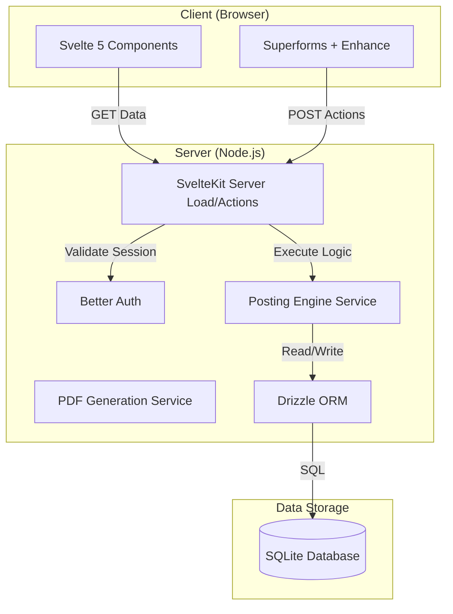

# Slate - System Architecture & Design System

> **Single Source of Truth for Architecture, Design Tokens, and Technical Implementation**  
> Version: 2.0 (Consolidated)  
> Audience: Developers & LLMs  
> Last Updated: February 2026

---

## 1. Executive Summary

**Slate** is a self-hosted, double-entry accounting system designed specifically for **Indian micro-enterprises**. It prioritizes business logic over accounting jargon, automating complex financial operations like GST compliance and double-entry posting behind a user-friendly interface.

### Core Philosophy
- **Business-First**: Users think in invoices and payments; the system translates to debits and credits.
- **Micro-Enterprise Focus**: Optimized for single-server, self-hosted deployment (SQLite).
- **Accounting Integrity**: Strict adherence to double-entry principles, immutability, and ACID compliance.

---

## 2. High-Level Architecture

Slate is a **Monolithic SvelteKit Application**. It does not use microservices. The frontend and backend run in the same process, communicating via internal SvelteKit `actions` and `load` functions.



---

## 3. Technology Stack

| Layer | Technology | Usage |
|:------|:-----------|:------|
| **Framework** | **SvelteKit** | Full-stack meta-framework (SSR + CSR) |
| **Frontend** | **Svelte 5** | Reactive UI (Runes mode: `$state`, `$derived`) |
| **Styling** | **Tailwind CSS v4** | Utility-first styling with custom design tokens |
| **Database** | **SQLite** | Embedded SQL database (via `better-sqlite3`) |
| **ORM** | **Drizzle ORM** | Type-safe database queries & schema management |
| **Auth** | **Better Auth** | Comprehensive authentication solution |
| **Validation** | **Zod** | Schema validation for forms and API inputs |
| **Math** | **Decimal.js** | Precision financial calculations (no floating point errors) |

---

## 4. Design System & Tokens (CRITICAL)

**LLM INSTRUCTION**: You MUST use the following Design Tokens for all UI development. Do NOT use raw Tailwind colors (e.g., `bg-blue-500`, `text-gray-700`) in application pages. Use the semantic tokens defined below.

### 4.1 Color Tokens (`app.css`)

Usage: `class="bg-surface-1 text-text-strong"`

| Token | Tailwind Class | Hex/HSL | Purpose |
|:------|:---------------|:--------|:--------|
| **Surfaces** | | | |
| `surface-0` | `bg-surface-0` | `hsl(0 0% 100%)` | Cards, inputs, table rows (White) |
| `surface-1` | `bg-surface-1` | `hsl(210 20% 98%)` | Page background (Light Blue-Grey) |
| `surface-2` | `bg-surface-2` | `hsl(210 20% 96%)` | Hover states, subtle fills |
| **Text** | | | |
| `text-strong` | `text-text-strong` | `hsl(220 20% 15%)` | Headings, primary data (Dark Blue-Grey) |
| `text-subtle` | `text-text-subtle` | `hsl(220 10% 45%)` | Secondary info, descriptions |
| `text-muted` | `text-text-muted` | `hsl(220 10% 65%)` | Labels, hints, timestamps |
| **Borders** | | | |
| `border` | `border-border` | `hsl(220 15% 92%)` | Default borders |
| `border-strong`| `border-border-strong`| `hsl(220 15% 85%)` | Input borders, focus rings |
| **Brand** | | | |
| `primary` | `bg-primary` | `#fb631b` | Main actions, links, active states (Orange) |

### 4.2 Semantic Status Colors

Use these for badges and indicators:

*   **Success** (`bg-green-50 text-green-700`): Paid, Active, Positive
*   **Warning** (`bg-amber-50 text-amber-700`): Pending, Partial, Due Soon
*   **Error** (`bg-red-50 text-red-700`): Overdue, Cancelled, Errors
*   **Info** (`bg-blue-50 text-blue-700`): Issued, Draft

### 4.3 Typography Tokens

*   **Font Sans** (`font-sans`): Inter (Default UI text)
*   **Font Mono** (`font-mono`): JetBrains Mono (Financial numbers, IDs, GSTINs)
*   **Font Display** (`font-display`): Space Grotesk (Brand/Logo only)

### 4.4 UI Patterns (Copy-Paste Ready)

**Page Layout Wrapper:**
```svelte
<div class="page-full-bleed">
    <header>...</header>
    <div class="flex-1 overflow-y-auto bg-surface-1">
        <!-- content -->
    </div>
</div>
```

**Data Table:**
```svelte
<div class="border border-border rounded-lg overflow-hidden bg-surface-0">
    <table class="data-table w-full">
        <!-- ... -->
    </table>
</div>
```

---

## 5. Backend Architecture & Business Logic

### 5.1 Directory Structure
```
src/
├── lib/server/
│   ├── db/                 # Database schema & connection
│   ├── services/           # CORE BUSINESS LOGIC
│   │   ├── posting-engine.ts # Double-entry accounting logic
│   │   ├── number-series.ts  # Auto-increment (INV-001)
│   │   └── pdf.ts           # PDF Generation
│   └── accounting/         # Invariant checks
├── routes/                 # SvelteKit Routes
│   ├── (app)/              # Protected App Routes
│   └── api/                # Internal API
```

### 5.2 The Posting Engine (`posting-engine.ts`)
This is the most critical service. It converts business actions into accounting journal entries.

**Logic Flow:**
1.  **Input**: User Action (e.g., "Create Invoice")
2.  **Validation**: Zod Schema check.
3.  **Posting**:
    *   Creates `Invoice` record.
    *   Creates `JournalEntry` (Header).
    *   Creates `JournalLine` items (Debits/Credits).
    *   Updates `Account` balances (Atomic Transaction).

**Example: Invoice Posting Rule**
*   **Debit**: Accounts Receivable (Asset)
*   **Credit**: Sales Revenue (Income)
*   **Credit**: Output GST (Liability)

### 5.3 Accounting Invariants
Rules enforced at Database and Application levels to ensure financial data integrity.

1.  **Balanced Entries**: Total Debits == Total Credits.
2.  **Immutability**: Posted entries CANNOT be edited, only reversed.
3.  **Single-Sided Lines**: A journal line is either Debit OR Credit, never both.
4.  **Non-Negative**: Amounts must be positive (use Debit/Credit to indicate direction).

---

## 6. Database Schema (Core Tables)

### Organizations (Tenant)
*   `id` (PK), `name`, `gstin`, `state_code`

### Accounts (Chart of Accounts)
*   `id` (PK), `account_code` (e.g., "1200"), `account_name`, `balance`
*   **Standard COA**:
    *   `1000`: Cash
    *   `1200`: Accounts Receivable
    *   `4000`: Sales Revenue

### Journal Entries (Ledger)
*   `id` (PK), `entry_number`, `total_debit`, `total_credit`, `status`
*   **Constraint**: `CHECK(total_debit = total_credit)`

### Invoices (Sub-Ledger)
*   `id` (PK), `invoice_number`, `total`, `balance_due`, `status`
*   `journal_entry_id` (FK to Journal Entries)

---

## 7. Key Workflows

### 7.1 Creating an Invoice
1.  User submits form at `/invoices/new`.
2.  `actions.default` validates data with Zod.
3.  Calls `postingEngine.postInvoiceIssuance()`.
4.  DB Transaction:
    *   Insert `Invoice` & `InvoiceItems`.
    *   Insert `JournalEntry` & `JournalLines`.
    *   Update `Account` balances.
    *   Increment `NumberSeries`.
5.  Redirect to `/invoices/[id]`.

### 7.2 Generating PDF
1.  Client requests `/api/invoices/[id]/pdf`.
2.  Server fetches Invoice data (and related Customer/Items).
3.  `pdfmake` generates PDF buffer on server (using headless Chrome via Puppeteer if needed for advanced layout, though `pdfmake` is JS-only).
4.  Server streams PDF with `Content-Disposition: attachment`.

---

## 8. Deployment

*   **Docker**: Multi-stage build (Node 18 Alpine).
*   **Environment Variables**:
    *   `SLATE_DB_PATH`: Path to SQLite file.
    *   `PUPPETEER_EXECUTABLE_PATH`: Path to Chromium (for specific PDF needs).

### Backup Strategy
*   SQLite is a single file (`slate.db`).
*   Backup = Copy the file.
*   Restore = Replace the file.

---

## 9. Security
*   **Authentication**: Better Auth (Session cookies, HTTP-only).
*   **Password Hashing**: Argon2id.
*   **Authorization**: `hooks.server.ts` validates session; `+layout.server.ts` checks Org ID.
*   **Data Isolation**: All DB queries MUST filter by `org_id`.

---

**Appendix**: For detailed code style rules, refer to [STYLE_GUIDE.md](./STYLE_GUIDE.md).
