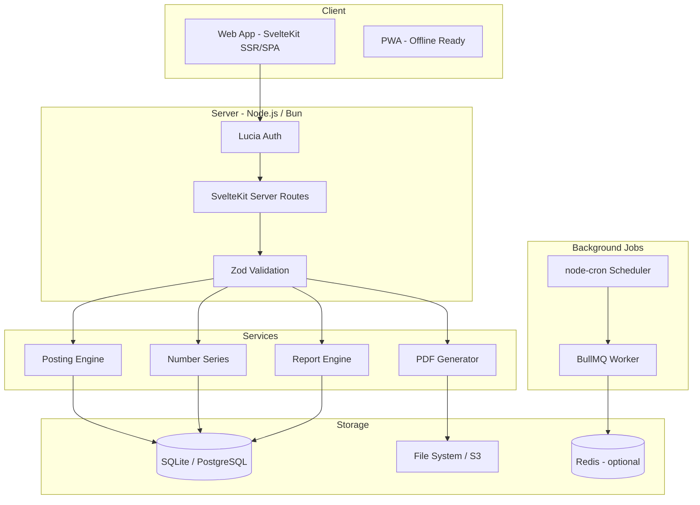
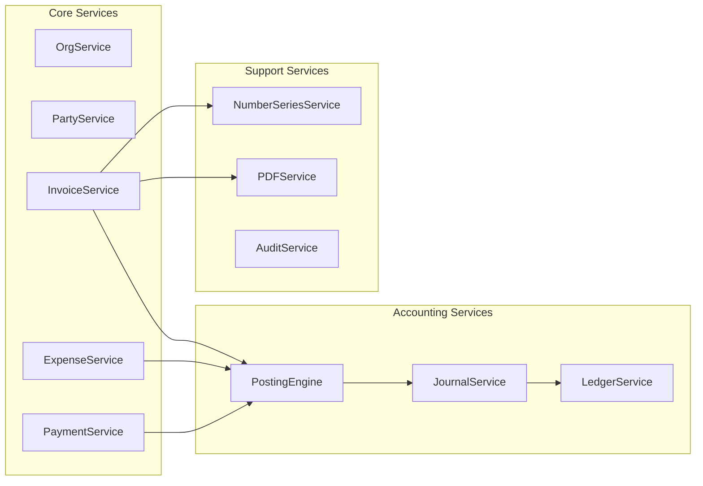
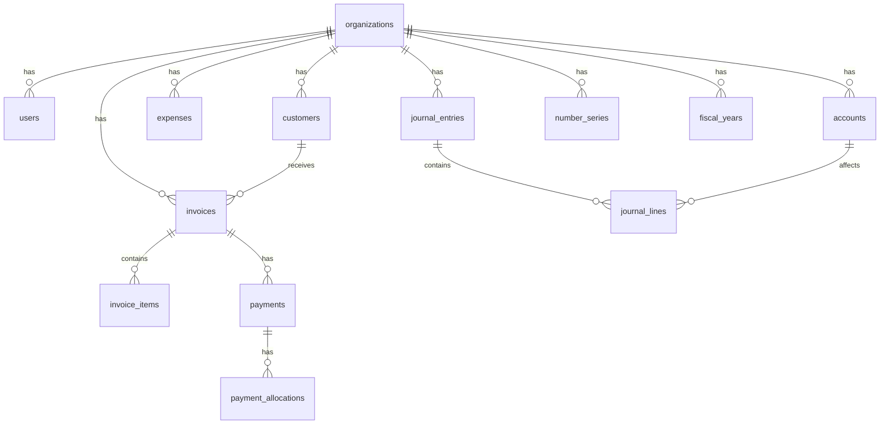
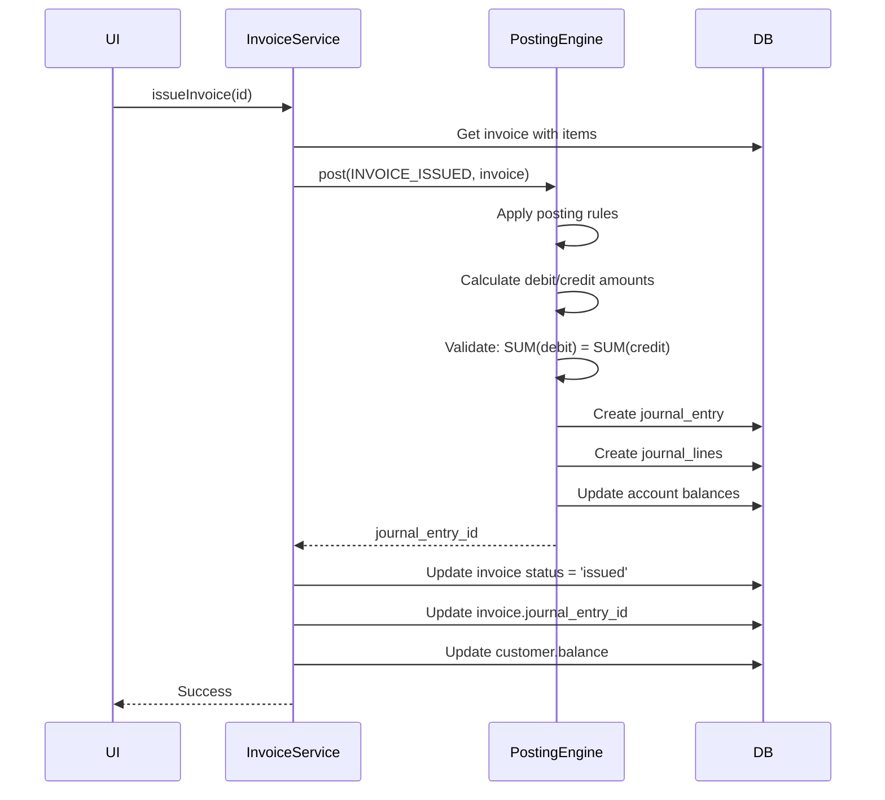

# OpenBill - Design Plan

## FOSS Accounting Software for Micro Enterprises (<20 Employees)

**Version**: 1.0  
**Date**: January 31, 2026  
**Status**: Ready for Development

---

## 1. Overview

### 1.1 What We're Building

**OpenBill** is a free, open-source, self-hosted accounting solution for Indian micro enterprises. It provides:

- Invoice creation with GST compliance
- Expense tracking
- Customer/Vendor management
- Double-entry accounting (hidden from user)
- Basic financial reports

### 1.2 Target Users

| Attribute | Description |
|-----------|-------------|
| **Business Size** | 1-20 employees |
| **Turnover** | Up to ₹5 Crores (MSME Micro) |
| **Technical Skill** | Low - No accounting knowledge required |
| **Current Tools** | Excel, paper bills, or basic apps like Vyapar |

### 1.3 Design Principles

1. **Simple by Default** - Hide accounting complexity (journals, ledgers)
2. **GST-Native** - Built for Indian tax compliance from day one
3. **Offline-First Ready** - Architecture supports future offline mode
4. **Self-Hosted** - No vendor lock-in, full data ownership
5. **Fast** - Edge deployment, sub-second page loads

---

## 2. Tech Stack

### 🎨 Frontend

| Layer | Technology | Why |
|-------|------------|-----|
| **UI** | SvelteKit | SSR + SPA + PWA ready |
| **Components** | shadcn-svelte | Beautiful, accessible, customizable components |
| **Styling** | Tailwind CSS | Utility-first, used by shadcn |
| **Utilities** | Lodash | Battle-tested utility functions |
| **Forms** | Zod + Superforms | Type-safe validation, progressive enhancement |
| **State** | Svelte stores | Built-in, reactive |
| **Charts** | Chart.js / ECharts | Lightweight, flexible |

### 🔌 Backend

| Layer | Technology | Why |
|-------|------------|-----|
| **API** | SvelteKit server routes | Unified codebase |
| **Runtime** | Node.js / Bun | Portable, self-hostable |
| **Jobs** | BullMQ / node-cron | PDF generation, backups, reminders |
| **Queue** | Redis (optional) | For BullMQ, can skip for small deployments |

### 🗄️ Database

| Layer | Technology | Why |
|-------|------------|-----|
| **Local/Dev** | SQLite | Zero config, embedded |
| **Cloud/Prod** | PostgreSQL | Scalable, full-featured |
| **ORM** | Drizzle ORM | Same schema for both, type-safe |

> [!TIP]
> Drizzle supports both SQLite and Postgres with the same schema definition. Switch via environment variable.

### 🔐 Authentication

| Layer | Technology | Why |
|-------|------------|-----|
| **Auth** | Lucia | Modern, framework-agnostic |
| **Hashing** | Argon2 | Industry standard, secure |
| **Sessions** | DB-backed | Persistent, revocable |

### 📂 Storage

| Layer | Technology | Why |
|-------|------------|-----|
| **Local** | File system | Simple, no dependencies |
| **Cloud** | S3-compatible (MinIO, R2) | Portable, any provider |
| **PDF Gen** | @react-pdf/renderer or Puppeteer | Server-side |

### 🧾 Accounting Engine

| Component | Description |
|-----------|-------------|
| **Journal Engine** | Custom double-entry posting |
| **Validation** | DR = CR on every entry |
| **Posting Rules** | Configurable per transaction type |
| **Locking** | Fiscal year lock |
| **Audit Trail** | Full change history |

---

## 3. System Architecture

### 3.1 High-Level Architecture



### 3.2 Service Layer



### 3.3 Multi-Tenancy

**Approach**: Row-level isolation with `org_id`

```typescript
// src/lib/server/middleware/org-context.ts
import { lucia } from '$lib/server/auth';

export async function getOrgContext(event: RequestEvent): Promise<OrgContext> {
  // Lucia validates session from cookie
  const sessionId = event.cookies.get(lucia.sessionCookieName);
  if (!sessionId) throw new AuthError('Not authenticated');
  
  const { session, user } = await lucia.validateSession(sessionId);
  if (!session || !user) throw new AuthError('Invalid session');
  
  // org_id MUST come from DB-backed session, never client
  return { 
    orgId: user.orgId, 
    userId: user.id,
    role: user.role 
  };
}
```

> [!WARNING]
> **Never trust client-provided org_id.** Always extract from server session.

---

## 4. Database Schema

### 4.1 Entity Relationship Diagram



### 4.2 Core Tables

#### organizations

```sql
CREATE TABLE organizations (
  id TEXT PRIMARY KEY,
  name TEXT NOT NULL,
  address TEXT,
  city TEXT,
  state_code TEXT NOT NULL,  -- 2-digit state code for GST
  pincode TEXT,
  phone TEXT,
  email TEXT,
  gstin TEXT,                -- 15-char GSTIN or NULL if unregistered
  pan TEXT,
  logo_url TEXT,
  currency TEXT DEFAULT 'INR',
  fy_start_month INTEGER DEFAULT 4,  -- April
  created_at TEXT DEFAULT CURRENT_TIMESTAMP,
  updated_at TEXT DEFAULT CURRENT_TIMESTAMP
);
```

#### users

```sql
CREATE TABLE users (
  id TEXT PRIMARY KEY,
  org_id TEXT NOT NULL REFERENCES organizations(id),
  email TEXT NOT NULL UNIQUE,
  password_hash TEXT NOT NULL,
  name TEXT NOT NULL,
  role TEXT DEFAULT 'admin',  -- admin, user
  is_active INTEGER DEFAULT 1,
  created_at TEXT DEFAULT CURRENT_TIMESTAMP,
  updated_at TEXT DEFAULT CURRENT_TIMESTAMP
);
```

#### customers

```sql
CREATE TABLE customers (
  id TEXT PRIMARY KEY,
  org_id TEXT NOT NULL REFERENCES organizations(id),
  
  -- Basic Info
  name TEXT NOT NULL,
  company_name TEXT,
  email TEXT,
  phone TEXT,
  
  -- Address
  billing_address TEXT,
  city TEXT,
  state_code TEXT,
  pincode TEXT,
  
  -- GST Info
  gstin TEXT,
  gst_treatment TEXT NOT NULL DEFAULT 'unregistered',
    -- registered, unregistered, consumer, overseas
  place_of_supply TEXT,  -- State code for GST
  
  -- Defaults
  payment_terms INTEGER DEFAULT 0,  -- Days
  
  -- Status
  balance REAL DEFAULT 0,  -- Current outstanding
  status TEXT DEFAULT 'active',
  
  -- Audit
  created_at TEXT DEFAULT CURRENT_TIMESTAMP,
  updated_at TEXT DEFAULT CURRENT_TIMESTAMP,
  created_by TEXT REFERENCES users(id),
  updated_by TEXT REFERENCES users(id)
);
```

#### invoices

```sql
CREATE TABLE invoices (
  id TEXT PRIMARY KEY,
  org_id TEXT NOT NULL REFERENCES organizations(id),
  customer_id TEXT NOT NULL REFERENCES customers(id),
  
  -- Numbers
  invoice_number TEXT NOT NULL,  -- INV-2026-0001
  order_number TEXT,             -- Customer PO reference
  
  -- Dates
  invoice_date TEXT NOT NULL,
  due_date TEXT NOT NULL,
  
  -- Status
  status TEXT NOT NULL DEFAULT 'draft',
    -- draft, issued, partially_paid, paid, cancelled
  
  -- Amounts
  subtotal REAL NOT NULL DEFAULT 0,
  discount_type TEXT,  -- percent, fixed
  discount_value REAL DEFAULT 0,
  discount_amount REAL DEFAULT 0,
  taxable_amount REAL NOT NULL DEFAULT 0,
  cgst REAL DEFAULT 0,
  sgst REAL DEFAULT 0,
  igst REAL DEFAULT 0,
  total REAL NOT NULL DEFAULT 0,
  amount_paid REAL DEFAULT 0,
  balance_due REAL NOT NULL DEFAULT 0,
  
  -- GST
  is_inter_state INTEGER DEFAULT 0,  -- 0 = intra, 1 = inter
  
  -- TDS (Phase 2 - columns added for future)
  tds_rate REAL DEFAULT 0,
  tds_amount REAL DEFAULT 0,
  
  -- E-Way Bill (Phase 2 - for goods > ₹50k interstate)
  eway_bill_no TEXT,
  eway_bill_date TEXT,
  vehicle_number TEXT,
  transporter_name TEXT,
  
  -- Multi-currency (Phase 3 - future-proof)
  currency TEXT DEFAULT 'INR',
  exchange_rate REAL DEFAULT 1,
  base_currency_total REAL,  -- Converted to org currency
  
  -- Content
  notes TEXT,
  terms TEXT,
  
  -- Journal reference
  journal_entry_id TEXT REFERENCES journal_entries(id),
  
  -- Audit
  issued_at TEXT,
  cancelled_at TEXT,
  created_at TEXT DEFAULT CURRENT_TIMESTAMP,
  updated_at TEXT DEFAULT CURRENT_TIMESTAMP,
  created_by TEXT REFERENCES users(id),
  updated_by TEXT REFERENCES users(id),
  
  UNIQUE(org_id, invoice_number)
);
```

#### invoice_items

```sql
CREATE TABLE invoice_items (
  id TEXT PRIMARY KEY,
  invoice_id TEXT NOT NULL REFERENCES invoices(id) ON DELETE CASCADE,
  
  -- Item details
  description TEXT NOT NULL,
  hsn_code TEXT,
  
  -- Quantity & Rate
  quantity REAL NOT NULL DEFAULT 1,
  unit TEXT DEFAULT 'nos',
  rate REAL NOT NULL,
  
  -- GST
  gst_rate REAL NOT NULL DEFAULT 18,  -- 0, 5, 12, 18, 28
  cgst REAL DEFAULT 0,
  sgst REAL DEFAULT 0,
  igst REAL DEFAULT 0,
  
  -- Totals
  amount REAL NOT NULL,  -- quantity * rate
  total REAL NOT NULL,   -- amount + gst
  
  sort_order INTEGER DEFAULT 0
);
```

#### payments

```sql
CREATE TABLE payments (
  id TEXT PRIMARY KEY,
  org_id TEXT NOT NULL REFERENCES organizations(id),
  customer_id TEXT NOT NULL REFERENCES customers(id),
  
  -- Numbers
  payment_number TEXT NOT NULL,  -- PAY-2026-0001
  
  -- Details
  payment_date TEXT NOT NULL,
  amount REAL NOT NULL,
  payment_mode TEXT NOT NULL,  -- cash, bank, upi, cheque
  reference TEXT,              -- Cheque no, UTR, etc.
  notes TEXT,
  
  -- Account
  deposit_to TEXT NOT NULL,  -- Account ID (Cash, Bank)
  
  -- Journal
  journal_entry_id TEXT REFERENCES journal_entries(id),
  
  -- Audit
  created_at TEXT DEFAULT CURRENT_TIMESTAMP,
  created_by TEXT REFERENCES users(id),
  
  UNIQUE(org_id, payment_number)
);
```

#### payment_allocations

```sql
CREATE TABLE payment_allocations (
  id TEXT PRIMARY KEY,
  payment_id TEXT NOT NULL REFERENCES payments(id),
  invoice_id TEXT NOT NULL REFERENCES invoices(id),
  amount REAL NOT NULL,
  created_at TEXT DEFAULT CURRENT_TIMESTAMP
);
```

#### expenses

```sql
CREATE TABLE expenses (
  id TEXT PRIMARY KEY,
  org_id TEXT NOT NULL REFERENCES organizations(id),
  
  -- Numbers
  expense_number TEXT NOT NULL,  -- EXP-2026-0001
  
  -- Details
  expense_date TEXT NOT NULL,
  category TEXT NOT NULL,  -- Account ID from Chart of Accounts
  vendor TEXT,
  description TEXT,
  
  -- Amounts
  amount REAL NOT NULL,
  gst_rate REAL DEFAULT 0,
  cgst REAL DEFAULT 0,
  sgst REAL DEFAULT 0,
  igst REAL DEFAULT 0,
  total REAL NOT NULL,
  
  -- Payment
  paid_through TEXT NOT NULL,  -- Account ID (Cash, Bank)
  reference TEXT,
  
  -- Attachments
  receipt_url TEXT,
  
  -- Journal
  journal_entry_id TEXT REFERENCES journal_entries(id),
  
  -- Audit
  created_at TEXT DEFAULT CURRENT_TIMESTAMP,
  updated_at TEXT DEFAULT CURRENT_TIMESTAMP,
  created_by TEXT REFERENCES users(id),
  
  UNIQUE(org_id, expense_number)
);
```

### 4.3 Accounting Tables

#### accounts (Chart of Accounts)

```sql
CREATE TABLE accounts (
  id TEXT PRIMARY KEY,
  org_id TEXT NOT NULL REFERENCES organizations(id),
  
  account_code TEXT NOT NULL,    -- 1000, 1100, etc.
  account_name TEXT NOT NULL,
  account_type TEXT NOT NULL,    -- asset, liability, equity, income, expense
  
  parent_id TEXT REFERENCES accounts(id),
  is_system INTEGER DEFAULT 0,   -- Cannot be deleted if 1
  is_active INTEGER DEFAULT 1,
  
  description TEXT,
  
  -- Running balance (updated on each journal post)
  balance REAL DEFAULT 0,
  
  created_at TEXT DEFAULT CURRENT_TIMESTAMP,
  
  UNIQUE(org_id, account_code)
);
```

#### journal_entries

```sql
CREATE TABLE journal_entries (
  id TEXT PRIMARY KEY,
  org_id TEXT NOT NULL REFERENCES organizations(id),
  
  entry_number TEXT NOT NULL,     -- JE-2026-0001
  entry_date TEXT NOT NULL,
  
  reference_type TEXT NOT NULL,   -- invoice, payment, expense, opening, manual
  reference_id TEXT,              -- ID of source document
  
  narration TEXT,
  
  total_debit REAL NOT NULL,
  total_credit REAL NOT NULL,
  
  status TEXT DEFAULT 'posted',   -- draft, posted, reversed
  reversed_by TEXT REFERENCES journal_entries(id),
  
  created_at TEXT DEFAULT CURRENT_TIMESTAMP,
  created_by TEXT REFERENCES users(id),
  
  UNIQUE(org_id, entry_number)
);
```

#### journal_lines

```sql
CREATE TABLE journal_lines (
  id TEXT PRIMARY KEY,
  journal_entry_id TEXT NOT NULL REFERENCES journal_entries(id),
  account_id TEXT NOT NULL REFERENCES accounts(id),
  
  debit REAL DEFAULT 0,
  credit REAL DEFAULT 0,
  
  party_type TEXT,        -- customer, vendor
  party_id TEXT,          -- customer_id or vendor_id
  
  narration TEXT
);
```

### 4.4 Support Tables

#### number_series

```sql
CREATE TABLE number_series (
  id TEXT PRIMARY KEY,
  org_id TEXT NOT NULL REFERENCES organizations(id),
  
  module TEXT NOT NULL,           -- invoice, payment, expense, journal
  prefix TEXT NOT NULL,           -- INV, PAY, EXP, JE
  current_number INTEGER DEFAULT 0,
  fy_year TEXT NOT NULL,          -- 2025-26
  reset_on_fy INTEGER DEFAULT 1,
  
  UNIQUE(org_id, module, fy_year)
);
```

#### fiscal_years

```sql
CREATE TABLE fiscal_years (
  id TEXT PRIMARY KEY,
  org_id TEXT NOT NULL REFERENCES organizations(id),
  
  name TEXT NOT NULL,             -- FY 2025-26
  start_date TEXT NOT NULL,
  end_date TEXT NOT NULL,
  
  is_current INTEGER DEFAULT 0,
  is_locked INTEGER DEFAULT 0,
  locked_at TEXT,
  locked_by TEXT REFERENCES users(id),
  
  created_at TEXT DEFAULT CURRENT_TIMESTAMP
);
```

#### audit_log

```sql
CREATE TABLE audit_log (
  id TEXT PRIMARY KEY,
  org_id TEXT NOT NULL,
  
  entity_type TEXT NOT NULL,      -- invoice, payment, customer, etc.
  entity_id TEXT NOT NULL,
  action TEXT NOT NULL,           -- create, update, delete, issue, cancel
  
  changed_fields TEXT,            -- JSON: {"status": {"old": "draft", "new": "issued"}}
  
  user_id TEXT NOT NULL REFERENCES users(id),
  ip_address TEXT,
  user_agent TEXT,
  
  created_at TEXT DEFAULT CURRENT_TIMESTAMP
);

CREATE INDEX idx_audit_entity ON audit_log(org_id, entity_type, entity_id);
CREATE INDEX idx_audit_date ON audit_log(org_id, created_at);
```

#### credit_notes

```sql
CREATE TABLE credit_notes (
  id TEXT PRIMARY KEY,
  org_id TEXT NOT NULL REFERENCES organizations(id),
  customer_id TEXT NOT NULL REFERENCES customers(id),
  invoice_id TEXT REFERENCES invoices(id),  -- Optional: linked to original invoice
  
  credit_note_number TEXT NOT NULL,  -- CN-2026-0001
  credit_note_date TEXT NOT NULL,
  
  -- Amounts
  subtotal REAL NOT NULL,
  cgst REAL DEFAULT 0,
  sgst REAL DEFAULT 0,
  igst REAL DEFAULT 0,
  total REAL NOT NULL,
  
  reason TEXT NOT NULL,           -- return, discount, error, etc.
  notes TEXT,
  
  status TEXT DEFAULT 'issued',   -- issued, applied, cancelled
  
  -- Journal
  journal_entry_id TEXT REFERENCES journal_entries(id),
  
  -- Audit
  created_at TEXT DEFAULT CURRENT_TIMESTAMP,
  created_by TEXT REFERENCES users(id),
  
  UNIQUE(org_id, credit_note_number)
);
```

#### customer_advances (for overpayments)

```sql
CREATE TABLE customer_advances (
  id TEXT PRIMARY KEY,
  org_id TEXT NOT NULL REFERENCES organizations(id),
  customer_id TEXT NOT NULL REFERENCES customers(id),
  payment_id TEXT REFERENCES payments(id),  -- Source payment
  
  amount REAL NOT NULL,
  balance REAL NOT NULL,          -- Remaining unapplied amount
  
  notes TEXT,
  
  created_at TEXT DEFAULT CURRENT_TIMESTAMP
);

CREATE INDEX idx_advances_customer ON customer_advances(org_id, customer_id);
```

### 4.5 Database Indexes (Security & Performance)

> [!IMPORTANT]
> **Every query MUST filter by org_id.** These indexes enforce this pattern.

```sql
-- Multi-tenancy security indexes
CREATE INDEX idx_customers_org ON customers(org_id);
CREATE INDEX idx_invoices_org ON invoices(org_id);
CREATE INDEX idx_expenses_org ON expenses(org_id);
CREATE INDEX idx_payments_org ON payments(org_id);
CREATE INDEX idx_accounts_org ON accounts(org_id);
CREATE INDEX idx_journals_org ON journal_entries(org_id);

-- Composite indexes for common queries
CREATE INDEX idx_invoices_org_customer ON invoices(org_id, customer_id);
CREATE INDEX idx_invoices_org_status ON invoices(org_id, status);
CREATE INDEX idx_invoices_org_date ON invoices(org_id, invoice_date);
CREATE INDEX idx_payments_org_customer ON payments(org_id, customer_id);
CREATE INDEX idx_journal_lines_account ON journal_lines(account_id);
CREATE INDEX idx_journal_lines_party ON journal_lines(party_type, party_id);
```

### 4.5 Pre-seeded Chart of Accounts (India Template)

| Code | Name | Type | System |
|------|------|------|--------|
| **Assets** |
| 1000 | Cash | asset | ✅ |
| 1100 | Bank Accounts | asset | ✅ |
| 1200 | Accounts Receivable | asset | ✅ |
| 1300 | Input CGST | asset | ✅ |
| 1301 | Input SGST | asset | ✅ |
| 1302 | Input IGST | asset | ✅ |
| **Liabilities** |
| 2000 | Accounts Payable | liability | ✅ |
| 2100 | Output CGST | liability | ✅ |
| 2101 | Output SGST | liability | ✅ |
| 2102 | Output IGST | liability | ✅ |
| **Equity** |
| 3000 | Capital Account | equity | ✅ |
| 3100 | Opening Balance Equity | equity | ✅ |
| **Income** |
| 4000 | Sales Revenue | income | ✅ |
| 4100 | Other Income | income | ✅ |
| **Expenses** |
| 5000 | Cost of Goods Sold | expense | ✅ |
| 6000 | Operating Expenses | expense | ✅ |
| 6100 | Rent | expense | ✅ |
| 6200 | Utilities | expense | ✅ |
| 6300 | Salaries | expense | ✅ |
| 6400 | Office Supplies | expense | ✅ |
| 6500 | Transportation | expense | ✅ |
| 6600 | Professional Fees | expense | ✅ |
| 6900 | Miscellaneous | expense | ✅ |

---

## 5. Posting Engine

The **Posting Engine** is the core accounting logic. It converts business transactions into journal entries.

### 5.1 Posting Rules

```typescript
const POSTING_RULES = {
  // When invoice is issued
  INVOICE_ISSUED: {
    debit: [
      { account: 'ACCOUNTS_RECEIVABLE', amount: 'total', partyType: 'customer' }
    ],
    credit: [
      { account: 'SALES_REVENUE', amount: 'taxable_amount' },
      { account: 'OUTPUT_CGST', amount: 'cgst', condition: 'intraState' },
      { account: 'OUTPUT_SGST', amount: 'sgst', condition: 'intraState' },
      { account: 'OUTPUT_IGST', amount: 'igst', condition: 'interState' }
    ]
  },
  
  // When payment received
  PAYMENT_RECEIVED: {
    debit: [
      { account: 'DEPOSIT_TO', amount: 'amount' }  // Cash or Bank
    ],
    credit: [
      { account: 'ACCOUNTS_RECEIVABLE', amount: 'amount', partyType: 'customer' }
    ]
  },
  
  // When expense recorded
  EXPENSE_RECORDED: {
    debit: [
      { account: 'EXPENSE_CATEGORY', amount: 'amount' },
      { account: 'INPUT_CGST', amount: 'cgst', condition: 'hasGST' },
      { account: 'INPUT_SGST', amount: 'sgst', condition: 'hasGST' },
      { account: 'INPUT_IGST', amount: 'igst', condition: 'hasGST' }
    ],
    credit: [
      { account: 'PAID_THROUGH', amount: 'total' }  // Cash or Bank
    ]
  },
  
  // Opening balance for customer
  OPENING_BALANCE_RECEIVABLE: {
    debit: [
      { account: 'ACCOUNTS_RECEIVABLE', amount: 'amount', partyType: 'customer' }
    ],
    credit: [
      { account: 'OPENING_BALANCE_EQUITY', amount: 'amount' }
    ]
  }
};
```

### 5.2 Posting Flow



### 5.3 Business Rules

| Rule | Trigger | Action |
|------|---------|--------|
| Journal must balance | Journal create | `SUM(debit) = SUM(credit)` or reject |
| Cannot edit issued invoice | Update Invoice | Block if status = 'issued' |
| Cannot delete issued invoice | Delete Invoice | Block, suggest 'Cancel' |
| Invoice cancellation | Cancel Invoice | Create reverse journal entry |
| FY locked | Any transaction | Block if date in locked FY |
| Unique invoice number | Create Invoice | Unique within org + FY |

---

## 6. GST Logic

### 6.1 Intra-State vs Inter-State

```typescript
function calculateGST(invoice: Invoice, customer: Customer, org: Organization) {
  const isInterState = customer.state_code !== org.state_code;
  
  for (const item of invoice.items) {
    const gstAmount = item.amount * (item.gst_rate / 100);
    
    if (isInterState) {
      item.igst = gstAmount;
      item.cgst = 0;
      item.sgst = 0;
    } else {
      item.igst = 0;
      item.cgst = gstAmount / 2;
      item.sgst = gstAmount / 2;
    }
    
    item.total = item.amount + gstAmount;
  }
  
  invoice.is_inter_state = isInterState ? 1 : 0;
}
```

### 6.2 GSTIN Validation (Enhanced)

```typescript
const GSTIN_REGEX = /^[0-9]{2}[A-Z]{5}[0-9]{4}[A-Z]{1}[1-9A-Z]{1}Z[0-9A-Z]{1}$/;

interface GSTINValidationResult {
  valid: boolean;
  error?: string;
  stateCode?: string;
  pan?: string;
}

function validateGSTIN(
  gstin: string, 
  expectedStateCode?: string, 
  expectedPAN?: string
): GSTINValidationResult {
  
  // Format check
  if (!GSTIN_REGEX.test(gstin)) {
    return { valid: false, error: 'Invalid GSTIN format' };
  }
  
  // Extract components
  const gstinStateCode = gstin.substring(0, 2);
  const gstinPAN = gstin.substring(2, 12);
  
  // State code range check (01-37)
  const stateNum = parseInt(gstinStateCode);
  if (stateNum < 1 || stateNum > 37) {
    return { valid: false, error: 'Invalid state code in GSTIN' };
  }
  
  // State code match (if provided)
  if (expectedStateCode && gstinStateCode !== expectedStateCode) {
    return { 
      valid: false, 
      error: `GSTIN state code (${gstinStateCode}) must match customer state (${expectedStateCode})` 
    };
  }
  
  // PAN match (if provided)
  if (expectedPAN && gstinPAN !== expectedPAN) {
    return { 
      valid: false, 
      error: 'PAN in GSTIN does not match provided PAN' 
    };
  }
  
  return { 
    valid: true, 
    stateCode: gstinStateCode, 
    pan: gstinPAN 
  };
}
```

### 6.3 Fiscal Year Validation

> [!WARNING]
> **Every transaction MUST validate its date falls in an open fiscal year.**

```typescript
async function validateFiscalYear(
  date: string, 
  orgId: string
): Promise<FiscalYear> {
  
  const fy = await db.query.fiscal_years.findFirst({
    where: and(
      eq(fiscal_years.org_id, orgId),
      lte(fiscal_years.start_date, date),
      gte(fiscal_years.end_date, date)
    )
  });
  
  if (!fy) {
    throw new ValidationError(
      'NO_FISCAL_YEAR',
      `No fiscal year defined for date ${date}. Please create a fiscal year first.`
    );
  }
  
  if (fy.is_locked) {
    throw new ValidationError(
      'FY_LOCKED',
      `Fiscal year ${fy.name} is locked. Cannot post transactions.`
    );
  }
  
  return fy;
}
```

### 6.4 Number Series - Concurrency Safe

> [!CAUTION]
> **Race condition risk**: Two users creating invoices simultaneously could get the same number.

**Solution**: Use atomic increment with `RETURNING`:

```typescript
async function getNextNumber(
  orgId: string, 
  module: 'invoice' | 'payment' | 'expense' | 'journal',
  fyYear: string
): Promise<string> {
  
  // Atomic increment using RETURNING
  const result = await db.run(sql`
    UPDATE number_series 
    SET current_number = current_number + 1 
    WHERE org_id = ${orgId} 
      AND module = ${module} 
      AND fy_year = ${fyYear}
    RETURNING current_number, prefix
  `);
  
  if (!result.rows.length) {
    // Create series if doesn't exist
    const prefix = { invoice: 'INV', payment: 'PAY', expense: 'EXP', journal: 'JE' }[module];
    await db.insert(number_series).values({
      id: generateId(),
      org_id: orgId,
      module,
      prefix,
      current_number: 1,
      fy_year: fyYear
    });
    return `${prefix}-${fyYear}-0001`;
  }
  
  const { current_number, prefix } = result.rows[0];
  return `${prefix}-${fyYear}-${String(current_number).padStart(4, '0')}`;
}
```

### 6.5 Payment Overpayment Handling

```typescript
async function allocatePayment(
  payment: Payment,
  allocations: { invoiceId: string; amount: number }[]
): Promise<void> {
  
  const totalAllocated = allocations.reduce((sum, a) => sum + a.amount, 0);
  
  // Validate: cannot allocate more than payment
  if (totalAllocated > payment.amount) {
    throw new ValidationError(
      'OVER_ALLOCATION',
      `Allocated amount (${totalAllocated}) exceeds payment (${payment.amount})`
    );
  }
  
  // Create allocations
  for (const alloc of allocations) {
    await db.insert(payment_allocations).values({
      id: generateId(),
      payment_id: payment.id,
      invoice_id: alloc.invoiceId,
      amount: alloc.amount
    });
    
    // Update invoice
    await updateInvoiceBalance(alloc.invoiceId, alloc.amount);
  }
  
  // Handle excess (overpayment) → Create customer advance
  if (totalAllocated < payment.amount) {
    const advance = payment.amount - totalAllocated;
    
    await db.insert(customer_advances).values({
      id: generateId(),
      org_id: payment.org_id,
      customer_id: payment.customer_id,
      payment_id: payment.id,
      amount: advance,
      balance: advance,
      notes: 'Auto-created from overpayment'
    });
    
    // Optionally notify user about advance created
  }
}
```

### 6.3 GST Rates

| Rate | Examples |
|------|----------|
| 0% | Essential items, exports |
| 5% | Basic necessities |
| 12% | Processed foods, computers |
| 18% | Most services, electronics |
| 28% | Luxury items, cars |

---

## 7. API Endpoints

### 7.1 Authentication

| Method | Endpoint | Description |
|--------|----------|-------------|
| POST | `/api/auth/login` | Login with email/password |
| POST | `/api/auth/logout` | Destroy session |
| GET | `/api/auth/me` | Current user info |

### 7.2 Organization

| Method | Endpoint | Description |
|--------|----------|-------------|
| GET | `/api/org` | Get organization details |
| PUT | `/api/org` | Update organization |
| POST | `/api/org/setup` | Initial setup wizard |

### 7.3 Customers

| Method | Endpoint | Description |
|--------|----------|-------------|
| GET | `/api/customers` | List customers |
| POST | `/api/customers` | Create customer |
| GET | `/api/customers/:id` | Get customer |
| PUT | `/api/customers/:id` | Update customer |
| DELETE | `/api/customers/:id` | Delete customer |
| GET | `/api/customers/:id/ledger` | Customer ledger |
| GET | `/api/customers/:id/statement` | PDF statement |

### 7.4 Invoices

| Method | Endpoint | Description |
|--------|----------|-------------|
| GET | `/api/invoices` | List invoices |
| POST | `/api/invoices` | Create invoice |
| GET | `/api/invoices/:id` | Get invoice |
| PUT | `/api/invoices/:id` | Update invoice (draft only) |
| POST | `/api/invoices/:id/issue` | Issue invoice (post to ledger) |
| POST | `/api/invoices/:id/cancel` | Cancel invoice (reverse entry) |
| GET | `/api/invoices/:id/pdf` | Download PDF |

### 7.5 Payments

| Method | Endpoint | Description |
|--------|----------|-------------|
| GET | `/api/payments` | List payments |
| POST | `/api/payments` | Create payment |
| GET | `/api/payments/:id` | Get payment |

### 7.6 Expenses

| Method | Endpoint | Description |
|--------|----------|-------------|
| GET | `/api/expenses` | List expenses |
| POST | `/api/expenses` | Create expense |
| GET | `/api/expenses/:id` | Get expense |
| PUT | `/api/expenses/:id` | Update expense |
| DELETE | `/api/expenses/:id` | Delete expense |
| POST | `/api/expenses/:id/receipt` | Upload receipt |

### 7.7 Reports

| Method | Endpoint | Description |
|--------|----------|-------------|
| GET | `/api/reports/aging` | Aging report |
| GET | `/api/reports/dso` | DSO calculation |
| GET | `/api/reports/gst-summary` | GST summary |

### 7.8 Response Format

```typescript
// Success
{
  success: true,
  data: { ... },
  meta: { page: 1, total: 100 }
}

// Error
{
  success: false,
  error: {
    code: "VALIDATION_ERROR",
    message: "Invoice number already exists",
    field: "invoiceNumber"
  }
}
```

---

## 8. Directory Structure

```
src/
├── lib/
│   ├── server/
│   │   ├── db/
│   │   │   ├── schema/
│   │   │   │   ├── organizations.ts
│   │   │   │   ├── users.ts
│   │   │   │   ├── customers.ts
│   │   │   │   ├── invoices.ts
│   │   │   │   ├── expenses.ts
│   │   │   │   ├── payments.ts
│   │   │   │   ├── accounts.ts
│   │   │   │   ├── journals.ts
│   │   │   │   └── index.ts
│   │   │   ├── seed.ts            # Chart of Accounts seeding
│   │   │   └── index.ts           # DB connection
│   │   │
│   │   ├── services/
│   │   │   ├── posting-engine.ts  # Core accounting logic
│   │   │   ├── number-series.ts
│   │   │   ├── gst.ts
│   │   │   ├── pdf-generator.ts
│   │   │   ├── ledger.ts
│   │   │   └── audit.ts
│   │   │
│   │   └── middleware/
│   │       ├── auth.ts
│   │       └── org-context.ts
│   │
│   ├── components/
│   │   ├── layout/
│   │   │   ├── Sidebar.svelte
│   │   │   ├── Header.svelte
│   │   │   └── AppShell.svelte
│   │   ├── forms/
│   │   │   ├── InvoiceForm.svelte
│   │   │   ├── CustomerForm.svelte
│   │   │   ├── ExpenseForm.svelte
│   │   │   └── PaymentForm.svelte
│   │   ├── tables/
│   │   │   └── DataTable.svelte
│   │   └── widgets/
│   │       ├── DSOWidget.svelte
│   │       ├── AgingChart.svelte
│   │       └── ReceivablesCard.svelte
│   │
│   └── utils/
│       ├── gst.ts                 # GST calculations
│       ├── dates.ts               # FY helpers
│       ├── format.ts              # Currency, numbers
│       └── validation.ts          # GSTIN, etc.
│
├── routes/
│   ├── (app)/                     # Authenticated routes
│   │   ├── +layout.svelte
│   │   ├── dashboard/+page.svelte
│   │   ├── invoices/
│   │   │   ├── +page.svelte       # List
│   │   │   ├── new/+page.svelte   # Create
│   │   │   └── [id]/+page.svelte  # View/Edit
│   │   ├── customers/
│   │   ├── expenses/
│   │   ├── payments/
│   │   ├── reports/
│   │   └── settings/
│   │
│   ├── api/                       # API routes
│   │   ├── auth/
│   │   ├── invoices/
│   │   ├── customers/
│   │   ├── expenses/
│   │   ├── payments/
│   │   └── reports/
│   │
│   ├── login/+page.svelte
│   └── setup/+page.svelte         # Onboarding wizard
│
├── app.html
└── app.css
```

---

## 9. Implementation Roadmap

### Sprint 0: Foundation (Week 1)
- [ ] Set up project structure
- [ ] Configure Drizzle + D1
- [ ] Create all database migrations
- [ ] Seed Chart of Accounts
- [ ] Basic auth (login/logout)

**Deliverable**: Empty app with schema + login

---

### Sprint 1: Organization & Customers (Week 2)
- [ ] Organization settings page
- [ ] Opening balance wizard
- [ ] Customer CRUD
- [ ] GST field validations

**Deliverable**: Manage org and customers

---

### Sprint 2: Invoice Core (Week 3)
- [ ] Invoice form with line items
- [ ] GST calculation (intra/inter)
- [ ] Draft save
- [ ] Invoice list with filters

**Deliverable**: Create draft invoices

---

### Sprint 3: Posting Engine (Week 4)
- [ ] Build PostingEngine service
- [ ] Invoice issue action
- [ ] Journal entry creation
- [ ] Number series generation

**Deliverable**: Issue invoices with accounting

---

### Sprint 4: Payments (Week 5)
- [ ] Payment form
- [ ] Invoice allocation
- [ ] Partial payment logic
- [ ] Payment posting

**Deliverable**: Record payments

---

### Sprint 5: Expenses (Week 6)
- [ ] Expense form
- [ ] Category selection
- [ ] Receipt upload (R2)
- [ ] Expense posting

**Deliverable**: Track expenses

---

### Sprint 6: PDF & Reports (Week 7)
- [ ] Invoice PDF template
- [ ] Customer statement PDF
- [ ] Aging report
- [ ] DSO widget
- [ ] Customer ledger

**Deliverable**: Documents & reports

---

### Sprint 7: Dashboard & Polish (Week 8)
- [ ] Dashboard widgets
- [ ] Receivables summary
- [ ] UI polish
- [ ] Error handling
- [ ] Testing

**Deliverable**: MVP ready

---

## 10. Testing Strategy

| Level | Tool | Focus |
|-------|------|-------|
| **Unit** | Vitest | Posting engine, GST calc |
| **Integration** | Vitest + D1 | API endpoints |
| **E2E** | Playwright | Invoice flow, payments |

### Critical Test Cases

1. Invoice issued creates balanced journal
2. Payment reduces customer balance
3. Intra-state GST splits correctly
4. Inter-state uses IGST only
5. Cannot edit issued invoice
6. Cancel creates reverse entry
7. **Concurrent invoice creation gets unique numbers**
8. **GSTIN state code must match customer state**
9. **Cannot post to locked fiscal year**
10. **Overpayment creates customer advance**

---

## 11. Security & Data Protection

| Concern | Mitigation |
|---------|------------|
| SQL Injection | Drizzle ORM (parameterized) |
| XSS | SvelteKit auto-escape |
| CSRF | SameSite cookies |
| Auth Bypass | org_id from session only |
| Data Isolation | Row-level org_id + indexes |
| File Access | Signed R2 URLs with expiry |
| **Audit Trail** | audit_log table for all changes |
| **FY Tampering** | Fiscal year locking |
| **Concurrency** | Atomic number series updates |

### 11.1 Backup Strategy

> [!CAUTION]
> **Cloudflare D1 has limited backup options.** Implement custom backup.

**Daily Backup to R2:**

```typescript
// Scheduled worker (cron: 0 2 * * *)
async function backupDatabase() {
  const timestamp = new Date().toISOString().split('T')[0];
  
  // Export all tables to JSON
  const tables = ['organizations', 'users', 'customers', 'invoices', ...];
  const backup: Record<string, any> = {};
  
  for (const table of tables) {
    backup[table] = await db.query[table].findMany();
  }
  
  // Upload to R2
  await r2.put(
    `backups/daily/${timestamp}.json`,
    JSON.stringify(backup),
    { httpMetadata: { contentType: 'application/json' } }
  );
  
  // Keep last 30 days, delete older
  await cleanupOldBackups(30);
}
```

**User Self-Export:**

```typescript
// API: GET /api/org/export
async function exportData(ctx: OrgContext) {
  const data = {
    organization: await db.query.organizations.findFirst({ where: eq(org_id, ctx.orgId) }),
    customers: await db.query.customers.findMany({ where: eq(org_id, ctx.orgId) }),
    invoices: await db.query.invoices.findMany({ where: eq(org_id, ctx.orgId) }),
    // ... all tables
  };
  
  return new Response(JSON.stringify(data, null, 2), {
    headers: {
      'Content-Type': 'application/json',
      'Content-Disposition': `attachment; filename="openbill-export-${Date.now()}.json"`
    }
  });
}
```

---

## 12. Success Metrics

| Metric | Target |
|--------|--------|
| Time to First Invoice | < 5 min |
| Invoice Creation | ≤ 4 clicks |
| Page Load | < 1 sec |
| Accounting Accuracy | 100% |
| GST Calculation | 100% |
| **Audit Coverage** | 100% of mutations logged |
| **Data Recovery** | < 24 hours RPO |

---

## Appendix A: Research Summary

This design is based on analysis of Zoho Books. Key insights:

1. **Hidden Complexity**: Double-entry journals run silently
2. **DSO Metric**: Critical for micro business cash flow
3. **Party Ledgers**: Required for trust
4. **GST Control**: Input/Output ledgers separate
5. **Draft vs Issued**: Clear state machine for documents

See browser recording: [Zoho Books Exploration](file:///Users/tahur/.gemini/antigravity/brain/ace1e44f-8c84-49dc-a3fd-cf2cf6c38a5d/zoho_books_exploration_1769857584757.webp)

---

## Appendix B: Zoho Books Screenshots

````carousel

<!-- slide -->

<!-- slide -->

<!-- slide -->

````

---

*Document Version: 1.0*  
*Last Updated: January 31, 2026*
